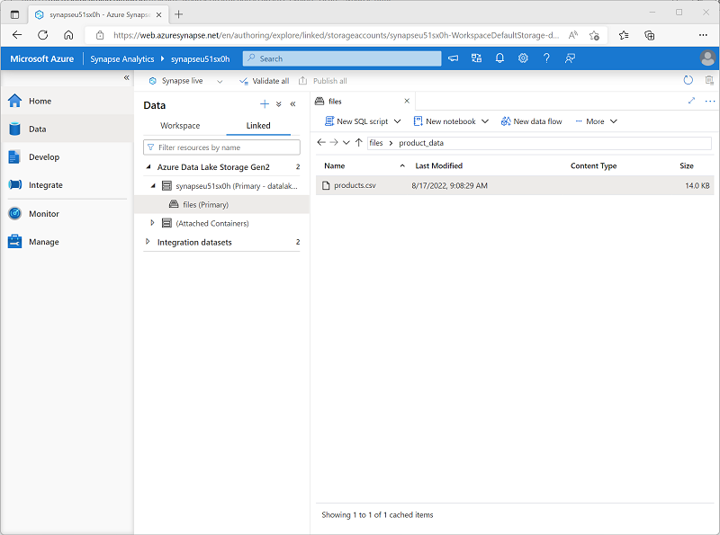

---
lab:
  title: 了解 Azure Synapse Analytics
  ilt-use: Lab
---

# 了解 Azure Synapse Analytics

Azure Synapse Analytics 为端到端数据分析提供了一个整合的数据分析平台。 在本练习中，你将探索各种引入和探索数据的方法。 本练习旨在简要概括 Azure Synapse Analytics 的各种核心功能。 其他练习可用于更详细地探索特定功能。

完成此练习大约需要 60 分钟。

## 准备工作

需要一个你在其中具有管理级权限的 [Azure 订阅](https://azure.microsoft.com/free)。

## 预配 Azure Synapse Analytics 工作区

Azure Synapse Analytics 工作区提供用于管理数据和数据处理运行时的中心点。 可以使用 Azure 门户中的交互式界面预配工作区，也可以使用脚本或模板在其中部署工作区和资源。 在大多数生产方案中，最好使用脚本和模板自动预配，以便可以将资源部署合并到可重复的开发和操作 (DevOps) 过程中。

在本练习中，你将组合使用 PowerShell 脚本和 ARM 模板来预配 Azure Synapse Analytics。

1. 在 Web 浏览器中，登录到 [Azure 门户](https://portal.azure.com)，网址为 `https://portal.azure.com`。
2. 使用页面顶部搜索栏右侧的 [\>_] 按钮在 Azure 门户中创建新的 Cloud Shell，在出现提示时选择“PowerShell”环境并创建存储。 Cloud Shell 在 Azure 门户底部的窗格中提供命令行界面，如下所示：

    

    > 注意：如果以前创建了使用 Bash 环境的 Cloud shell，请使用 Cloud Shell 窗格左上角的下拉菜单将其更改为“PowerShell”。

3. 请注意，可以通过拖动窗格顶部的分隔条或使用窗格右上角的 &#8212;、&#9723; 或 X 图标来调整 Cloud Shell 的大小，以最小化、最大化和关闭窗格  。 有关如何使用 Azure Cloud Shell 的详细信息，请参阅 [Azure Cloud Shell 文档](https://docs.microsoft.com/azure/cloud-shell/overview)。

4. 在 PowerShell 窗格中，输入以下命令以克隆此存储库：

    ```
    rm -r dp-203 -f
    git clone https://github.com/MicrosoftLearning/dp-203-azure-data-engineer dp-203
    ```

5. 克隆存储库后，输入以下命令以更改为此练习的文件夹，然后运行其中包含的 setup.ps1 脚本：

    ```
    cd dp-203/Allfiles/labs/01
    ./setup.ps1
    ```

6. 如果出现提示，请选择要使用的订阅（仅当有权访问多个 Azure 订阅时才会发生这种情况）。
7. 出现提示时，输入要为 Azure Synapse SQL 池设置的合适密码。

    > 注意：请务必记住此密码！ 此外，密码不能包含全部或部分登录名。

8. 等待脚本完成 - 这通常需要大约 20 分钟，但在某些情况下可能需要更长的时间。 在等待期间，请查看 Azure Synapse Analytics 文档中的[什么是 Azure Synapse Analytics？](https://docs.microsoft.com/azure/synapse-analytics/overview-what-is)一文。

## 探索 Synapse Studio

Synapse Studio 是一个基于 Web 的门户，可在其中管理并使用 Azure Synapse Analytics 工作区中的资源。

1. 安装脚本运行完毕后，在 Azure 门户中，转到其创建的 **dp203-*xxxxxxx*** 资源组，注意此资源组包含 Synapse 工作区、数据湖的存储帐户、Apache Spark 池和专用 SQL 池。
2. 选择 Synapse 工作区，并在其“概述”页的“打开 Synapse Studio”卡中选择“打开”，在新的浏览器标签页中打开 Synapse Studio。Synapse Studio 是一个基于 Web 的界面，可用于处理 Synapse Analytics 工作区  。
3. 在 Synapse Studio 左侧，使用 &rsaquo;&rsaquo; 图标展开菜单，这将显示 Synapse Studio 中用于管理资源和执行数据分析任务的不同页面，如下所示：

    

4. 查看“数据”页面，注意有两个包含数据源的选项卡：
    - 一个“工作区”选项卡，其中包含在工作区中定义的数据库（包括专用 SQL 数据库和数据资源管理器数据库）
    - 一个“已链接”选项卡，包含链接到工作区的数据源，包括 Azure Data Lake 存储。

5. 查看“开发”页面，该页面当前为空。 可以在此处定义用于开发数据处理解决方案的脚本和其他资产。
6. 查看“集成”页面，该页面也为空。 使用此页面来管理数据引入和集成资产；例如在数据源之间传输和转换数据的管道。
7. 查看“监视”页面。 可以在此处观察数据处理作业的运行情况并查看其历史记录。
8. 查看“管理”页。 可以在此处管理 Azure Synapse 工作区中使用的池、运行时和其他资产。 查看“分析池”部分中的每个选项卡，并注意工作区包括以下池：
    - SQL 池：
        - 内置：无服务器 SQL 池，可按需用于通过 SQL 命令来探索或处理数据湖中的数据。
        - sqlxxxxxxx：托管关系数据仓库数据库的专用 SQL 池* 。
    - Apache Spark 池：
        - sparkxxxxxxx：可按需用于通过 Scala 或 Python 等编程语言来探索或处理数据湖中的数据*。

## 使用管道引入数据

可以使用 Azure Synapse Analytics 执行的关键任务之一是定义管道，将数据从各种源传输到你的工作区（如有必要还会进行转换）以进行分析。

### 使用复制数据任务创建管道

1. 在 Synapse Studio 的“主页”上，选择“引入”以打开“复制数据”工具
2. 在“复制数据”工具的“属性”步骤上，确保已选中“内置复制任务”和“立即运行一次”，然后单击“下一步 >”。
3. 在“源”步骤的“数据集”子步骤中，选择以下设置：
    - 源类型：全部
    - 连接：创建新的连接，然后在显示的“链接服务”窗格中，在“通用协议”选项卡上，选择“HTTP”。然后，使用以下设置继续并创建与数据文件的连接：*  *
        - 名称：产品
        - 说明：通过 HTTP 提供的产品列表
        - 通过集成运行时连接：AutoResolveIntegrationRuntime
        - 基 URL：`https://raw.githubusercontent.com/MicrosoftLearning/dp-203-azure-data-engineer/master/Allfiles/labs/01/adventureworks/products.csv`
        - 服务器证书验证：启用
        - 身份验证类型：匿名
4. 创建连接后，在“源数据存储”页面上，确保选择了以下设置，然后选择“下一步 >” ：
    - 相对 URL：留空
    - 请求方法：GET
    - 其他标题：留空
    - 二进制副本：处于<u>未</u>选择状态
    - 请求超时：留空
    - 最大并发连接数：留空
5. 在“源”步骤的“配置”子步骤中，选择“预览数据”，查看管道将引入的产品数据预览，然后关闭预览。
6. 预览数据后，在“文件格式设置”页面上，确保选择了以下设置，然后选择“下一步 >” ：
    - **文件格式**： DelimitedText
    - 列分隔符：逗号 (,)
    - 行分隔符：换行符 (\n)
    - 首行用作标题：已选择
    - 压缩类型：无
7. 在“目标”步骤的“数据集”子步骤中，选择以下设置：
    - 目标类型：Azure Data Lake Storage Gen 2
    - 连接：选择与数据湖存储的现有连接，（这是在你创建工作区时为你创建的）。
8. 选择连接后，在“目标/数据集”步骤中，确保选择以下设置，然后选择“下一步 >” ：
    - 文件夹路径：files/product_data
    - 文件名：products.csv
    - 复制行为：无
    - 最大并发连接数：留空
    - 块大小 (MB)：留空
9. 在“目标”步骤的“配置”子步骤的“文件格式设置”页面上，确保已选择以下属性  。 然后选择“下一步 >”：
    - **文件格式**： DelimitedText
    - 列分隔符：逗号 (,)
    - 行分隔符：换行符 (\n)
    - 将标题添加到文件：已选择
    - 压缩类型：无
    - 每个文件的最大行数：留空
    - 文件名前缀：留空
10. 在“设置”步骤上，输入以下设置，然后单击“下一步 >”：
    - 任务名称：复制产品
    - 任务说明：复制产品数据
    - 容错：留空
    - 启用日志记录：处于<u>未</u>选择状态
    - 启用暂存：处于<u>未</u>选择状态
11. 在“查看并完成”步骤的“查看”子步骤上，阅读摘要，然后单击“下一步 >”。
12. 在“部署”步骤中，等待管道部署完成，然后单击“完成”。
13. 在 Synapse Studio 中，选择“监视”页，然后在“管道运行”选项卡中等待“复制产品”管道完成，状态为“成功”（可以使用“管道运行”页上的“&#8635; 刷新”按钮来刷新状态）    。
14. 查看“集成”页面，并验证其现在是否包含一个名为“复制产品”的管道 。

### 查看引入的数据

1. 在“数据”页面上，选择“链接”选项卡并展开“synapsexxxxxxx (主) datalake”容器层次结构，直到看到 Synapse 工作区的“文件”文件存储 。 然后选择文件存储以验证包含“products.csv”文件的名为“product_data”的文件夹是否已复制到此位置，如下所示 ：

    

2. 右键单击“products.csv”数据文件并选择“预览”以查看引入的数据 。 然后关闭预览。

## 使用无服务器 SQL 池分析数据

你已将一些数据引入工作区，现在可以使用 Synapse Analytics 来查询和分析数据了。 查询数据的最常见方法之一是使用 SQL，在 Synapse Analytics 中，可以使用无服务器 SQL 池对数据湖中的数据运行 SQL 代码。

1. 在 Synapse Studio 中，右键单击 Synapse 工作区文件存储中的“products.csv”文件，指向“新建 SQL 脚本”，然后选择“选择前 100 行”。
2. 在打开的“SQL 脚本 1”窗格中，查看已生成的 SQL 代码，应如下所示：

    ```SQL
    -- This is auto-generated code
    SELECT
        TOP 100 *
    FROM
        OPENROWSET(
            BULK 'https://datalakexxxxxxx.dfs.core.windows.net/files/product_data/products.csv',
            FORMAT = 'CSV',
            PARSER_VERSION='2.0'
        ) AS [result]
    ```

    此代码将从你导入的文本文件中打开一个行集，并检索前 100 行数据。

3. 在“连接到”列表中，确保已选中“内置”，这表示通过工作区创建的内置 SQL 池。
4. 在工具栏上，使用“▷ 运行”按钮运行 SQL 代码，并查看结果，结果应如下所示：

    | C1 | C2 | C3 | C4 |
    | -- | -- | -- | -- |
    | ProductID | ProductName | 类别 | ListPrice |
    | 771 | Mountain-100 Silver, 38 | 山地自行车 | 3399.9900 |
    | 772 | Mountain-100 Silver, 42 | 山地自行车 | 3399.9900 |
    | [.] | [.] | [.] | [.] |

5. 请注意，结果由名为 C1、C2、C3 和 C4 的四列组成；结果中的第一行包含数据字段的名称。 要解决此问题，请将 HEADER_ROW = TRUE 参数添加到 OPENROWSET 函数，如下所示（将 datalakexxxxxxx 替换为数据湖存储帐户的名称），然后重新运行查询：

    ```SQL
    SELECT
        TOP 100 *
    FROM
        OPENROWSET(
            BULK 'https://datalakexxxxxxx.dfs.core.windows.net/files/product_data/products.csv',
            FORMAT = 'CSV',
            PARSER_VERSION='2.0',
            HEADER_ROW = TRUE
        ) AS [result]
    ```

    现在，结果如下所示：

    | ProductID | ProductName | 类别 | ListPrice |
    | -- | -- | -- | -- |
    | 771 | Mountain-100 Silver, 38 | 山地自行车 | 3399.9900 |
    | 772 | Mountain-100 Silver, 42 | 山地自行车 | 3399.9900 |
    | [.] | [.] | [.] | [.] |

6. 按如下方式修改查询（将 datalakexxxxxxx 替换为数据湖存储帐户的名称）：

    ```SQL
    SELECT
        Category, COUNT(*) AS ProductCount
    FROM
        OPENROWSET(
            BULK 'https://datalakexxxxxxx.dfs.core.windows.net/files/product_data/products.csv',
            FORMAT = 'CSV',
            PARSER_VERSION='2.0',
            HEADER_ROW = TRUE
        ) AS [result]
    GROUP BY Category;
    ```

7. 运行修改后的查询，它应该返回一个包含每个类别中产品数量的结果集，如下所示：

    | 类别 | ProductCount |
    | -- | -- |
    | Bib Shorts | 3 |
    | 自行车车架 | 1 |
    | [.] | [.] |

8. 在“SQL 脚本 1”的“属性”窗格中，将“名称”更改为“产品计数(按类别)”。 然后在工具栏中，选择“发布”以保存脚本。

9. 关闭“产品计数(按类别)”脚本窗格。

10. 在 Synapse Studio 中，选择“开发”页，注意到已发布的“产品计数(按类别)”SQL 脚本已保存在那里。

11. 选择“产品计数(按类别)”SQL 脚本以重新打开它。 然后，确保该脚本已连接到”内置”SQL 池，并运行它来检索产品计数。

12. 在“结果”窗格中，选择“图表”视图，然后为图表选择以下设置：
    - 图表类型：柱形图
    - 类别列：类别
    - 图例(系列)列：ProductCount
    - 图例位置：靠下居中
    - 图例(系列)标签：留空
    - 图例(系列)最小值：留空
    - 图例(系列)最大值：留空
    - 类别标签：留空

    生成的图表应如下所示：

    

## 使用 Spark 池来分析数据

虽然 SQL 是用于查询结构化数据集的常见语言，但许多数据分析师发现，像 Python 这样的语言对研究和准备数据用于分析很有用。 在 Azure Synapse Analytics 中，可以在 Spark 池中运行 Python（及其其他）代码；它使用了基于 Apache Spark 的分布式数据处理引擎。

1. 在 Synapse Studio 中，如果之前打开的包含“products.csv”文件的“文件”选项卡已关闭，请在“数据”页上浏览“product_data”文件夹   。 然后右键单击“products.csv”，指向“新建笔记本”，然后选择“加载到数据帧”。
2. 在打开的“笔记本 1”窗格中，在“附加到”列表中，选择 Spark 池“sparkxxxxxxx”，并确保“语言”设置为“PySpark (Python)”    。
3. 查看笔记本中的第一个（也是唯一一个）单元格中的代码，它应该如下所示：

    ```Python
    %%pyspark
    df = spark.read.load('abfss://files@datalakexxxxxxx.dfs.core.windows.net/product_data/products.csv', format='csv'
    ## If header exists uncomment line below
    ##, header=True
    )
    display(df.limit(10))
    ```

4. 使用代码单元格左侧的“▷”图标运行它，并等待结果。 当你第一次在笔记本中运行单元格时，Spark 池会启动，因此可能需要一分钟左右的时间来返回任何结果。
5. 最终，结果应显示在单元格下面，应如下所示：

    | c0 | c1 | _c2_ | _c3_ |
    | -- | -- | -- | -- |
    | ProductID | ProductName | 类别 | ListPrice |
    | 771 | Mountain-100 Silver, 38 | 山地自行车 | 3399.9900 |
    | 772 | Mountain-100 Silver, 42 | 山地自行车 | 3399.9900 |
    | [.] | [.] | [.] | [.] |

6. 取消注释“,header=True”这一行（因为 products.csv 文件的第一行包含列标题），因此代码如下所示：

    ```Python
    %%pyspark
    df = spark.read.load('abfss://files@datalakexxxxxxx.dfs.core.windows.net/product_data/products.csv', format='csv'
    ## If header exists uncomment line below
    , header=True
    )
    display(df.limit(10))
    ```

7. 重新运行单元格，并验证结果是否如下所示：

    | ProductID | ProductName | 类别 | ListPrice |
    | -- | -- | -- | -- |
    | 771 | Mountain-100 Silver, 38 | 山地自行车 | 3399.9900 |
    | 772 | Mountain-100 Silver, 42 | 山地自行车 | 3399.9900 |
    | [.] | [.] | [.] | [.] |

    请注意，再次运行单元格所花的时间会更短，因为 Spark 池已经启动了。

8. 在结果下，使用“+ 代码”图标向笔记本添加一个新的代码单元格。
9. 在新的空代码单元格中，添加以下代码：

    ```Python
    df_counts = df.groupby(df.Category).count()
    display(df_counts)
    ```

10. 通过单击“▷”图标来运行新代码单元格，并查看结果，结果应如下所示：

    | 类别 | count |
    | -- | -- |
    | 耳机 | 3 |
    | 车轮 | 14 |
    | [.] | [.] |

11. 在单元格的结果输出中，选择“图表”视图。 生成的图表应如下所示：

    

12. 如果尚不可见，请选择工具栏右侧的“属性”按钮（看起来类似于“&#128463;<sub>*</sub>”）以显示“属性”页面  。 然后在“属性”窗格中，将笔记本名称更改为“浏览产品”并使用工具栏上的“发布”按钮进行保存  。

13. 关闭笔记本窗格，并在出现提示时停止 Spark 会话。 然后查看“开发”页面以验证笔记本是否已保存。

## 使用专用 SQL 池查询数据仓库

到目前为止，你已经了解了一些用于在数据湖中浏览和处理基于文件的数据的技术。 在许多情况下，企业分析解决方案使用数据湖来存储和准备非结构化数据，然后将其加载到关系数据仓库中，以支持商业智能 (BI) 工作负载。 在 Azure Synapse Analytics 中，这些数据仓库可以在专用 SQL 池中实现。

1. 在 Synapse Studio 中，在“管理”页面的“SQL 池”部分，选择“sqlxxxxxxx”专用 SQL 池行，然后使用其“&#9655;”图标恢复该行   。
2. 等待 SQL 池启动。 这可能需要几分钟的时间。 使用“&#8635; 刷新”按钮定期检查其状态。 状态将在准备就绪时显示为“联机”。
3. SQL 池启动后，选择“数据”页面；在“工作区”选项卡上，展开“SQL 数据库”，并验证是否列出“sqlxxxxxxx”（如有必要，使用页面左上角的“&#8635;”图标刷新视图）    。
4. 展开“sqlxxxxxxx”数据库及其“Tables”文件夹，然后在“FactInternetSales”表的“...”菜单中，指向“新建 SQL 脚本”，然后选择“选择前 100 行”     。
5. 查看查询结果，其中显示表中的前 100 个销售事务。 此数据由安装脚本加载到数据库中，并永久存储在与专用 SQL 池关联的数据库中。
6. 将 SQL 查询替换为以下代码：

    ```sql
    SELECT d.CalendarYear, d.MonthNumberOfYear, d.EnglishMonthName,
           p.EnglishProductName AS Product, SUM(o.OrderQuantity) AS UnitsSold
    FROM dbo.FactInternetSales AS o
    JOIN dbo.DimDate AS d ON o.OrderDateKey = d.DateKey
    JOIN dbo.DimProduct AS p ON o.ProductKey = p.ProductKey
    GROUP BY d.CalendarYear, d.MonthNumberOfYear, d.EnglishMonthName, p.EnglishProductName
    ORDER BY d.MonthNumberOfYear
    ```

7. 使用“&#9655; 运行”按钮运行修改后的查询，返回按年和月销售的每种产品的数量。
8. 如果尚不可见，请选择工具栏右侧的“属性”按钮（看起来类似于“&#128463;<sub>*</sub>”）以显示“属性”页面  。 然后在“属性”窗格中，将查询名称更改为“聚合产品销售”并使用工具栏上的“发布”按钮进行保存  。

9. 关闭查询窗格，然后查看“开发”页面以验证 SQL 脚本是否已保存。

10. 在“管理”页面上，选择“sqlxxxxxxx”专用 SQL 池行并使用其“&#10074;&#10074;”图标将其暂停 。

<!--- ## Explore data with a Data Explorer pool

Azure Synapse Data Explorer provides a runtime that you can use to store and query data by using Kusto Query Language (KQL). Kusto is optimized for data that includes a time series component, such as realtime data from log files or IoT devices.

### Create a Data Explorer database and ingest data into a table

1. In Synapse Studio, on the **Manage** page, in the **Data Explorer pools** section, select the **adx*xxxxxxx*** pool row and then use its **&#9655;** icon to resume it.
2. Wait for the pool to start. It can take some time. Use the **&#8635; Refresh** button to check its status periodically. The status will show as **online** when it is ready.
3. When the Data Explorer pool has started, view the **Data** page; and on the **Workspace** tab, expand **Data Explorer Databases** and verify that **adx*xxxxxxx*** is listed (use **&#8635;** icon at the top-left of the page to refresh the view if necessary)
4. In the **Data** pane, use the **&#65291;** icon to create a new **Data Explorer database** in the **adx*xxxxxxx*** pool with the name **sales-data**.
5. In Synapse Studio, wait for the database to be created (a notification will be displayed).
6. Switch to the **Develop** page, and in the **+** menu, add a KQL script. Then, when the script pane opens, in the **Connect to** list, select your **adx*xxxxxxx*** pool, and in the **Database** list, select **sales-data**.
7. In the new script, add the following code:

    ```kusto
    .create table sales (
        SalesOrderNumber: string,
        SalesOrderLineItem: int,
        OrderDate: datetime,
        CustomerName: string,
        EmailAddress: string,
        Item: string,
        Quantity: int,
        UnitPrice: real,
        TaxAmount: real)
    ```

8. On the toolbar, use the **&#9655; Run** button to run the selected code, which creates a table named **sales** in the **sales-data** database you created previously.
9. After the code has run successfully, replace it with the following code, which loads data into the table:

    ```kusto
    .ingest into table sales 'https://raw.githubusercontent.com/microsoftlearning/dp-203-azure-data-engineer/master/Allfiles/labs/01/files/sales.csv' 
    with (ignoreFirstRecord = true)
    ```

10. Run the new code to ingest the data.

> **Note**: In this example, you imported a very small amount of batch data from a file, which is fine for the purposes of this exercise. In reality, you can use Data Explorer to analyze much larger volumes of data; including realtime data from a streaming source such as Azure Event Hubs.

### Use Kusto query language to query the table

1. Switch back to the **Data** page and in the **...** menu for the **sales-data** database, select **Refresh**.
2. Expand the **sales-data** database's **Tables** folder. Then in the **...** menu for the **sales** table, select **New KQL script** > **Take 1000 rows**.
3. Review the generated query and its results. The query should contain the following code:

    ```kusto
    sales
    | take 1000
    ```

    The results of the query contain the first 1000 rows of data.

4. Modify the query as follows:

    ```kusto
    sales
    | where Item == 'Road-250 Black, 48'
    ```

5. Use the **&#9655; Run** button to run the query. Then review the results, which should contain only the rows for sales orders for the *Road-250 Black, 48* product.

6. Modify the query as follows:

    ```kusto
    sales
    | where Item == 'Road-250 Black, 48'
    | where datetime_part('year', OrderDate) > 2020
    ```

7. Run the query and review the results, which should contain only sales orders for *Road-250 Black, 48* made after 2020.

8. Modify the query as follows:

    ```kusto
    sales
    | where OrderDate between (datetime(2020-01-01 00:00:00) .. datetime(2020-12-31 23:59:59))
    | summarize TotalNetRevenue = sum(UnitPrice) by Item
    | sort by Item asc
    ```

9. Run the query and review the results, which should contain the total net revenue for each product between January 1st and December 31st 2020 in ascending order of product name.

10. If it is not already visible, show the **Properties** page by selecting the **Properties** button (which looks similar to **&#128463;<sub>*</sub>**) on the right end of the toolbar. Then in the **Properties** pane, change the query name to **Explore sales data** and use the **Publish** button on the toolbar to save it.

11. Close the query pane, and then view the **Develop** page to verify that the KQL script has been saved.

12. On the **Manage** page, select the **adx*xxxxxxx*** Data Explorer pool row and use its &#10074;&#10074; icon to pause it. --->

## 删除 Azure 资源

你已完成对 Azure Synapse Analytics 的探索，现在应删除已创建的资源，以避免产生不必要的 Azure 成本。

1. 关闭 Synapse Studio 浏览器选项卡并返回到 Azure 门户。
2. 在 Azure 门户的“主页”上，选择“资源组”。
3. 选择 Synapse Analytics 工作区的 **dp203-*xxxxxxx*** 资源组（不是托管资源组），并验证它是否包含 Synapse 工作区、存储帐户、SQL 池和工作区的 Spark 池。
4. 在资源组的“概述”页的顶部，选择“删除资源组”。
5. 输入 dp203-xxxxxxx 资源组名称以确认要删除该资源组，然后选择“删除” 。

    几分钟后，将删除 Azure Synapse 工作区资源组及其关联的托管工作区资源组。
