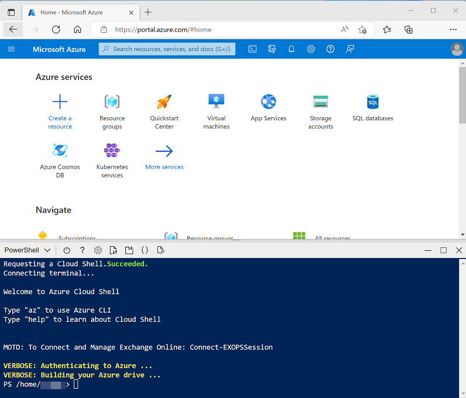

---
lab:
  title: 使用 Spark 分析 Data Lake 中的数据
  module: 'Model, query, and explore data in Azure Synapse'
---

# 使用 Spark 分析 Data Lake 中的数据

Apache Spark 是用于分布式数据处理的开放源代码引擎，广泛用于探索、处理和分析 Data Lake Storage 中的大量数据。 Spark 在许多数据平台产品中作为处理选项提供，包括 Azure HDInsight、Azure Databricks 和 Microsoft Azure 云平台上的 Azure Synapse Analytics。 Spark 的优点之一是支持各种编程语言，包括 Java、Scala、Python 和 SQL；这让 Spark 一种非常灵活的数据处理工作负载（包括数据清理和操作、统计分析和机器学习以及数据分析和可视化）解决方案。

完成本实验室大约需要 45 分钟。

## 准备工作

需要一个你在其中具有管理级权限的 [Azure 订阅](https://azure.microsoft.com/free)。

## 预配 Azure Synapse Analytics 工作区

需要一个 Azure Synapse Analytics 工作区，该工作区可以访问 Data Lake Storage 和 Apache Spark 池（可用于查询和处理 Data Lake 中的文件）。

在本练习中，你将组合使用 PowerShell 脚本和 ARM 模板来预配 Azure Synapse Analytics 工作区。

1. 登录到 Azure 门户，地址为 [](https://portal.azure.com)。
2. 使用页面顶部搜索栏右侧的 [\>_] 按钮在 Azure 门户中创建新的 Cloud Shell，在出现提示时选择“PowerShell”环境并创建存储。 Cloud Shell 在 Azure 门户底部的窗格中提供命令行界面，如下所示：

    

    > 注意：如果以前创建了使用 Bash 环境的 Cloud shell，请使用 Cloud Shell 窗格左上角的下拉菜单将其更改为“PowerShell”。

3. 请注意，可以通过拖动窗格顶部的分隔条或使用窗格右上角的 &#8212;、&#9723; 或 X 图标来调整 Cloud Shell 的大小，以最小化、最大化和关闭窗格  。 有关如何使用 Azure Cloud Shell 的详细信息，请参阅 [Azure Cloud Shell 文档](https://docs.microsoft.com/azure/cloud-shell/overview)。

4. 在 PowerShell 窗格中，输入以下命令以克隆此存储库：

    ```
    rm -r dp203 -f
    git clone https://github.com/MicrosoftLearning/DP-203-Azure-Data-Engineer dp203
    ```

5. 克隆存储库后，输入以下命令以更改为此实验室的文件夹，然后运行其中包含的 setup.ps1 脚本：

    ```
    cd dp203/Allfiles/labs/02
    ./setup.ps1
    ```

6. 如果出现提示，请选择要使用的订阅（仅当有权访问多个 Azure 订阅时才会发生这种情况）。
7. 出现提示时，输入要为 Azure Synapse SQL 池设置的合适密码。

    > 注意：请务必记住此密码！

8. 等待脚本完成 - 此过程通常需要大约 10 分钟；但在某些情况下可能需要更长的时间。 等待时，请查看 Azure Synapse Analytics 文档中的 [Azure Synapse Analytics 中的 Apache Spark](https://docs.microsoft.com/azure/synapse-analytics/spark/apache-spark-overview) 一文。

## 查询文件中的数据

该脚本预配 Azure Synapse Analytics 工作区和 Azure 存储帐户来托管 Data Lake，然后将一些数据文件上传到 Data Lake。

### 查看 Data Lake 中的文件

1. 脚本完成后，在 Azure 门户中转到创建的 dp500-*xxxxxxx* 资源组，然后选择 Synapse 工作区。
2. 在 Synapse 工作区“概述”页的“打开 Synapse Studio”卡中，选择“打开”，以在新浏览器标签页中打开 Synapse Studio；如果出现提示，请进行登录  。
3. 在 Synapse Studio 左侧，使用 &rsaquo;&rsaquo; 图标展开菜单，这将显示 Synapse Studio 中用于管理资源和执行数据分析任务的不同页面。
4. 在“管理”页上，选择“Apache Spark 池”选项卡，请注意工作区中已预配名称类似于 spark*xxxxxxx* 的 Spark 池  。 稍后，你将使用此 Spark 池从工作区的 Data Lake Storage 的文件中加载和分析数据。
5. 在“数据”页上，查看“已链接”选项卡并验证工作区是否包含 Azure Data Lake Storage Gen2 存储帐户的链接，该帐户的名称应类似于 synapsexxxxxxx* (Primary - datalake xxxxxxx*) ** 。
6. 展开存储帐户，验证它是否包含名为 files 的文件系统容器。
7. 选择“files”容器，并注意它包含名为 sales 和 synapse 的文件夹  。 synapse 文件夹由 Azure Synapse 使用，而 sales 文件夹包含要查询的数据文件 。
8. 打开 sales 文件夹及其包含的 orders 文件夹，并观察 orders 文件夹中包含具有三年销售数据的 .csv 文件  。
9. 右键单击任一文件，然后选择“预览”以查看它所包含的数据。 请注意，这些文件不包含标题行，因此你可以取消选择显示列标题的选项。

### 使用 Spark 浏览数据

1. 选择 orders 文件夹中的任意文件，然后在工具栏上的“新建笔记本”列表中选择“加载到 DataFrame”  。 数据帧是 Spark 中表示表格数据集的结构。
2. 在打开的新“笔记本 1”选项卡中的“附加到”列表中，选择 Spark 池 (*sparkxxxxxxx***) 。 然后使用“&#9655; 全部运行”运行笔记本中的所有单元格（目前只有一个！）。

    由于这是你第一次在此会话中运行 Spark 代码，因此必须启动 Spark 池。 这意味着会话中的第一次运行可能需要几分钟时间。 后续运行速度会更快。

3. 在等待 Spark 会话初始化时，请查看生成的代码；如下所示：

    ```Python
    %%pyspark
    df = spark.read.load('abfss://files@datalakexxxxxxx.dfs.core.windows.net/sales/orders/2019.csv', format='csv'
    ## If header exists uncomment line below
    ##, header=True
    )
    display(df.limit(10))
    ```

4. 代码运行完成后，请查看笔记本中单元格下方的输出。 它显示所选文件中的前十行，它们采用 _c0、_c1、_c2 等格式的自动列名  。
5. 修改代码，使 spark.read.load 函数从文件夹中<u>所有</u> CSV 文件中读取数据，使 display 函数显示前 100 行 。 代码应类似于（datalakexxxxxxx 与 Data Lake Storage 的名称相匹配）：

    ```Python
    %%pyspark
    df = spark.read.load('abfss://files@datalakexxxxxxx.dfs.core.windows.net/sales/orders/*.csv', format='csv'
    )
    display(df.limit(100))
    ```

6. 使用代码单元格左侧的“&#9655;”按钮仅运行该单元格，然后查看结果。

    数据帧现包含所有文件的数据，但列名没有用。 Spark 使用“读取时架构”方法来尝试根据列包含的数据确定列的适当数据类型，如果文本文件中存在标题行，则可以使用它来标识列名（方法是在 load 函数中指定 header=True 参数） 。 或者，可以为数据帧定义显式架构。

7. 按如下方式修改代码（替换 datalakexxxxxxx），为包含列名和数据类型的数据帧定义显式架构。 在单元格中重新运行代码。

    ```Python
    %%pyspark
    from pyspark.sql.types import *
    from pyspark.sql.functions import *

    orderSchema = StructType([
        StructField("SalesOrderNumber", StringType()),
        StructField("SalesOrderLineNumber", IntegerType()),
        StructField("OrderDate", DateType()),
        StructField("CustomerName", StringType()),
        StructField("Email", StringType()),
        StructField("Item", StringType()),
        StructField("Quantity", IntegerType()),
        StructField("UnitPrice", FloatType()),
        StructField("Tax", FloatType())
        ])

    df = spark.read.load('abfss://files@datalakexxxxxxx.dfs.core.windows.net/sales/orders/*.csv', format='csv', schema=orderSchema)
    display(df.limit(100))
    ```

8. 在结果下，使用“+ 代码”向笔记本添加一个新的代码单元格。 然后在新单元格中，添加以下代码以显示数据帧的架构：

    ```Python
    df.printSchema()
    ```

9. 运行新单元格并验证数据帧架构是否与定义的 orderSchema 相匹配。 使用具有自动推断的架构的数据帧时，printSchema 函数非常有用。

## 分析数据帧中的数据

Spark 中的 dataframe 对象类似于 Python 中的 Pandas 数据帧，它包含各种可用于操作、筛选、分组或以其他方式分析其所含数据的函数。

### 筛选数据帧

1. 在笔记本中新增一个代码单元格，并在其中输入以下代码：

    ```Python
    customers = df['CustomerName', 'Email']
    print(customers.count())
    print(customers.distinct().count())
    display(customers.distinct())
    ```

2. 运行新的代码单元格，并查看结果。 观察以下详细信息：
    - 对数据帧执行操作时，结果是一个新数据帧（在本例中，是一个新客户数据帧，它是通过从 df 数据帧中选择特定的列子集来创建的）
    - 数据帧提供 count 和 distinct 等函数，可用于汇总和筛选它们包含的数据 。
    - `dataframe['Field1', 'Field2', ...]` 语法是用于定义列子集的快速方法。 还可以使用 select 方法，所以上述代码的第一行可以编写为 `customers = df.select("CustomerName", "Email")`

3. 按如下所示修改代码：

    ```Python
    customers = df.select("CustomerName", "Email").where(df['Item']=='Road-250 Red, 52')
    print(customers.count())
    print(customers.distinct().count())
    display(customers.distinct())
    ```

4. 运行修改后的代码来查看已购买 Road-250 Red, 52 产品的客户。 请注意，可以“链接”多个函数，使一个函数的输出成为下一个函数的输入；在这种情况下，由 select 方法创建的数据帧是用于应用筛选条件的 where 方法的源数据帧 。

### 在数据帧中对数据进行聚合和分组

1. 在笔记本中新增一个代码单元格，并在其中输入以下代码：

    ```Python
    productSales = df.select("Item", "Quantity").groupBy("Item").sum()
    display(productSales)
    ```

2. 运行添加的代码单元格，并注意结果显示按产品分组的订单数量之和。 groupBy 方法按“项”对行进行分组，随后将 sum 聚合函数应用于所有剩余的数值列（在本例中为“数量”）

3. 在笔记本中再次新增一个代码单元格，并在其中输入以下代码：

    ```Python
    yearlySales = df.select(year("OrderDate").alias("Year")).groupBy("Year").count().orderBy("Year")
    display(yearlySales)
    ```

4. 运行添加的代码单元格，并注意结果显示每年的销售订单数。 请注意，select 方法包括一个 SQL year 函数，它用于提取 OrderDate 字段的年份部分，然后 alias 方法用于为提取的年份值分配一个列名称 。 接下来，按派生的“年份”列对数据进行分组，并计算每个组中的行计数，最后使用 orderBy 方法对生成的数据帧进行排序。

## 使用 Spark SQL 查询数据

如你所见，dataframe 对象的本机方法能让你非常有效地查询和分析数据。 但是，许多数据分析师更习惯使用 SQL 语法。 Spark SQL 是 Spark 中的 SQL 语言 API，可用于运行 SQL 语句，甚至可将数据保存在关系表中。

### 在 PySpark 代码中使用 Spark SQL

Azure Synapse Studio 笔记本中的默认语言是 PySpark，它是一个基于 Spark 的 Python 运行时。 在此运行时中，可以使用 spark.sql 库将 Spark SQL 语法嵌入到 Python 代码中，并处理表和视图等 SQL 构造。

1. 在笔记本中新增一个代码单元格，并在其中输入以下代码：

    ```Python
    df.createOrReplaceTempView("salesorders")

    spark_df = spark.sql("SELECT * FROM salesorders")
    display(spark_df)
    ```

2. 运行单元格并查看结果。 观察以下情况：
    - 代码将 df 数据帧中的数据保存为名为 salesorders 的临时视图 。 Spark SQL 支持使用临时视图或永久性表作为 SQL 查询的源。
    - 然后，使用 spark.sql 方法对 salesorders 视图运行 SQL 查询 。
    - 查询结果存储在数据帧中。

### 在单元格中运行 SQL

虽然能够将 SQL 语句嵌入到包含 PySpark 代码的单元格中非常有用，但数据分析师通常只想直接使用 SQL。

1. 在笔记本中新增一个代码单元格，并在其中输入以下代码：

    ```sql
    %%sql
    SELECT YEAR(OrderDate) AS OrderYear,
           SUM((UnitPrice * Quantity) + Tax) AS GrossRevenue
    FROM salesorders
    GROUP BY YEAR(OrderDate)
    ORDER BY OrderYear;
    ```

2. 运行单元格并查看结果。 观察以下情况：
    - 单元格开头的 `%%sql` 行（称为 magic）指示应使用 Spark SQL 语言运行时来运行此单元格中的代码，而不是 PySpark。
    - SQL 代码引用以前使用 PySpark 创建的 salesorder 视图。
    - SQL 查询的输出将自动显示为单元格下的结果。

> 注意：有关 Spark SQL 和数据帧的详细信息，请参阅 [Spark SQL 文档](https://spark.apache.org/docs/2.2.0/sql-programming-guide.html)。

## 使用 Spark 直观呈现数据

众所周知，一张图片胜过千言万语，而图表通常胜过千行数据。 虽然 Azure Synapse Analytics 中的笔记本包含一个内置图表视图，用于从数据帧或 Spark SQL 查询显示的数据，但它并非专为全面的图表而设计。 但是，可以使用 Python 图形库（如 matplotlib 和 seaborn）根据数据帧中的数据创建图表 。

### 以图表形式查看结果

1. 在笔记本中新增一个代码单元格，并在其中输入以下代码：

    ```sql
    %%sql
    SELECT * FROM salesorders
    ```

2. 运行代码并观察它是否从之前创建的 salesorders 视图返回数据。
3. 在单元格下方的结果部分中，将“视图”选项从“表格”更改为“图表”  。
4. 使用图表右上角的“视图选项”按钮显示图表的选项窗格。 然后按如下方式设置选项并选择“应用”：
    - **图表类型**：条形图
    - **键**：项
    - **值**：数量
    - **序列组**：留空
    - **聚合**：Sum
    - **堆积**：未选中

5. 验证图表是否如下所示：

    

### matplotlib 入门

1. 在笔记本中新增一个代码单元格，并在其中输入以下代码：

    ```Python
    sqlQuery = "SELECT CAST(YEAR(OrderDate) AS CHAR(4)) AS OrderYear, \
                    SUM((UnitPrice * Quantity) + Tax) AS GrossRevenue \
                FROM salesorders \
                GROUP BY CAST(YEAR(OrderDate) AS CHAR(4)) \
                ORDER BY OrderYear"
    df_spark = spark.sql(sqlQuery)
    df_spark.show()
    ```

2. 运行代码并观察它是否返回包含年收入的 Spark 数据帧。

    若要将数据可视化为图表，要首先使用 matplotlib Python 库。 此库是其他许多库所基于的核心绘图库，在创建图表方面提供了极大的灵活性。

3. 在笔记本中新增一个代码单元格，并在其中添加以下代码：

    ```Python
    from matplotlib import pyplot as plt

    # matplotlib requires a Pandas dataframe, not a Spark one
    df_sales = df_spark.toPandas()

    # Create a bar plot of revenue by year
    plt.bar(x=df_sales['OrderYear'], height=df_sales['GrossRevenue'])

    # Display the plot
    plt.show()
    ```

4. 运行单元格并查看结果，结果中包含每年总收入的柱形图。 请注意用于生成此图表的代码的以下功能：
    - matplotlib 库需要 Pandas 数据帧，因此需要将 Spark SQL 查询返回的 Spark 数据帧转换为此格式 。
    - matplotlib 库的核心是 pyplot 对象 。 这是大多数绘图功能的基础。
    - 默认设置会生成一个可用图表，但它有很大的自定义空间

5. 修改代码以绘制图表，如下所示：

    ```Python
    # Clear the plot area
    plt.clf()

    # Create a bar plot of revenue by year
    plt.bar(x=df_sales['OrderYear'], height=df_sales['GrossRevenue'], color='orange')

    # Customize the chart
    plt.title('Revenue by Year')
    plt.xlabel('Year')
    plt.ylabel('Revenue')
    plt.grid(color='#95a5a6', linestyle='--', linewidth=2, axis='y', alpha=0.7)
    plt.xticks(rotation=45)

    # Show the figure
    plt.show()
    ```

6. 重新运行代码单元格并查看结果。 图表现在包含更多信息。

    严格来说，绘图包含图。 在前面的示例中，图是隐式创建的；但也可以显式创建它。

7. 修改代码以绘制图表，如下所示：

    ```Python
    # Clear the plot area
    plt.clf()

    # Create a Figure
    fig = plt.figure(figsize=(8,3))

    # Create a bar plot of revenue by year
    plt.bar(x=df_sales['OrderYear'], height=df_sales['GrossRevenue'], color='orange')

    # Customize the chart
    plt.title('Revenue by Year')
    plt.xlabel('Year')
    plt.ylabel('Revenue')
    plt.grid(color='#95a5a6', linestyle='--', linewidth=2, axis='y', alpha=0.7)
    plt.xticks(rotation=45)

    # Show the figure
    plt.show()
    ```

8. 重新运行代码单元格并查看结果。 图确定绘图的形状和大小。

    图可以包含多个子图，每个子图都其自己的轴上。

9. 修改代码以绘制图表，如下所示：

    ```Python
    # Clear the plot area
    plt.clf()

    # Create a figure for 2 subplots (1 row, 2 columns)
    fig, ax = plt.subplots(1, 2, figsize = (10,4))

    # Create a bar plot of revenue by year on the first axis
    ax[0].bar(x=df_sales['OrderYear'], height=df_sales['GrossRevenue'], color='orange')
    ax[0].set_title('Revenue by Year')

    # Create a pie chart of yearly order counts on the second axis
    yearly_counts = df_sales['OrderYear'].value_counts()
    ax[1].pie(yearly_counts)
    ax[1].set_title('Orders per Year')
    ax[1].legend(yearly_counts.keys().tolist())

    # Add a title to the Figure
    fig.suptitle('Sales Data')

    # Show the figure
    plt.show()
    ```

10. 重新运行代码单元格并查看结果。 图包含代码中指定的子图。

> 注意：若要详细了解如何使用 matplotlib 绘图，请参阅 [matplotlib 文档](https://matplotlib.org/)。

### 使用 seaborn 库

虽然 matplotlib 可创建多种类型的复杂图表，但它可能需要一些复杂的代码才能获得最佳结果。 因此，多年来，许多新库都建立在 matplotlib 的基础之上，移除了其复杂性，增强了其功能。 seaborn 就是这样的一种库。

1. 在笔记本中新增一个代码单元格，并在其中输入以下代码：

    ```Python
    import seaborn as sns

    # Clear the plot area
    plt.clf()

    # Create a bar chart
    ax = sns.barplot(x="OrderYear", y="GrossRevenue", data=df_sales)
    plt.show()
    ```

2. 运行代码并观察它是否使用 seaborn 库显示条形图。
3. 在笔记本中新增一个代码单元格，并在其中输入以下代码：

    ```Python
    # Clear the plot area
    plt.clf()

    # Set the visual theme for seaborn
    sns.set_theme(style="whitegrid")

    # Create a bar chart
    ax = sns.barplot(x="OrderYear", y="GrossRevenue", data=df_sales)
    plt.show()
    ```

4. 运行代码，注意 seaborn 能够让你为绘图设置一致的颜色主题。

5. 在笔记本中新增一个代码单元格，并在其中输入以下代码：

    ```Python
    # Clear the plot area
    plt.clf()

    # Create a bar chart
    ax = sns.lineplot(x="OrderYear", y="GrossRevenue", data=df_sales)
    plt.show()
    ```

6. 运行代码，以折线图的形式查看年收入。

> 注意：若要详细了解如何使用 seaborn 绘图，请参阅 [seaborn 文档](https://seaborn.pydata.org/index.html)。

## 删除 Azure 资源

你已完成对 Azure Synapse Analytics 的探索，现在应删除已创建的资源，以避免产生不必要的 Azure 成本。

1. 关闭 Synapse Studio 浏览器选项卡并返回到 Azure 门户。
2. 在 Azure 门户的“主页”上，选择“资源组”。
3. 选择 Synapse Analytics 工作区的 dp500-*xxxxxxx* 资源组（不是受管理资源组），并确认它包含 Synapse 工作区、存储帐户和工作区的 Spark 池。
4. 在资源组的“概述”页的顶部，选择“删除资源组”。
5. 输入 dp500-*xxxxxxx* 资源组名称以确认要删除该资源组，然后选择“删除” 。

    几分钟后，将删除 Azure Synapse 工作区资源组及其关联的托管工作区资源组。
