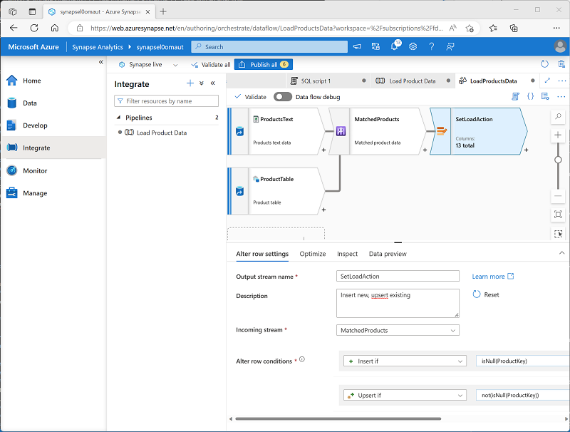

---
lab:
  title: 在 Azure Synapse Analytics 中生成数据管道
  ilt-use: Lab
---

# 在 Azure Synapse Analytics 中生成数据管道

在本练习中，你将使用 Azure Synapse Analytics Explorer 中的管道将数据加载到专用 SQL 池中。 管道将封装一个数据流，用于将产品数据加载到数据仓库中的表中。

完成此练习大约需要 45 分钟。

## 准备工作

需要一个你在其中具有管理级权限的 [Azure 订阅](https://azure.microsoft.com/free)。

## 预配 Azure Synapse Analytics 工作区

你需要一个可以访问 Data Lake Storage 的 Azure Synapse Analytics 工作区，以及一个托管关系数据仓库的专用 SQL 池。

在本练习中，你将组合使用 PowerShell 脚本和 ARM 模板来预配 Azure Synapse Analytics 工作区。

1. 登录到 Azure 门户，地址为 [](https://portal.azure.com)。
2. 使用页面顶部搜索栏右侧的 [\>_] 按钮在 Azure 门户中创建新的 Cloud Shell，在出现提示时选择“PowerShell”环境并创建存储。 Cloud Shell 在 Azure 门户底部的窗格中提供命令行界面，如下所示：

    

    > 注意：如果以前创建了使用 Bash 环境的 Cloud shell，请使用 Cloud Shell 窗格左上角的下拉菜单将其更改为“PowerShell”。

3. 请注意，可以通过拖动窗格顶部的分隔条来调整 Cloud Shell 的大小，或使用窗格右上角的“—”、“&#9723;”和“X”图标来最小化、最大化和关闭窗格 。 有关如何使用 Azure Cloud Shell 的详细信息，请参阅 [Azure Cloud Shell 文档](https://docs.microsoft.com/azure/cloud-shell/overview)。

4. 在 PowerShell 窗格中，输入以下命令以克隆此存储库：

    ```powershell
    rm -r dp-203 -f
    git clone https://github.com/MicrosoftLearning/dp-203-azure-data-engineer dp-203
    ```

5. 克隆存储库后，输入以下命令以更改为此练习的文件夹，然后运行其中包含的 setup.ps1 脚本：

    ```powershell
    cd dp-203/Allfiles/labs/10
    ./setup.ps1
    ```

6. 如果出现提示，请选择要使用的订阅（仅当有权访问多个 Azure 订阅时才会发生这种情况）。
7. 出现提示时，输入要为 Azure Synapse SQL 池设置的合适密码。

    > 注意：请务必记住此密码！

8. 等待脚本完成 - 此过程通常需要大约 10 分钟；但在某些情况下可能需要更长的时间。 等待时，请查看 Azure Synapse Analytics 文档中的 [Azure Synapse Analytics 中的数据流](https://learn.microsoft.com/azure/synapse-analytics/concepts-data-flow-overview)一文。

## 查看源数据存储和目标数据存储

本练习的源数据是包含产品数据的文本文件。 目标数据是专用 SQL 池中的表。 你的目标是创建一个用于封装数据流的管道，其中文件中的产品数据将被加载到表中；插入新产品并更新现有产品。

1. 脚本完成后，在 Azure 门户中转到创建的 dp203-xxxxxxx 资源组，然后选择 Synapse 工作区。
2. 在 Synapse 工作区“概述”页的“打开 Synapse Studio”卡中，选择“打开”，以在新浏览器标签页中打开 Synapse Studio；如果出现提示，请进行登录  。
3. 在 Synapse Studio 左侧，使用 ›› 图标展开菜单，这将显示 Synapse Studio 中用于管理资源和执行数据分析任务的不同页面。
4. 在“管理”页的“SQL 池”选项卡上，选择 sqlxxxxxxx 专用 SQL 池所在的行，并使用其 &#9655; 图标进行启动；在出现系统提示时确认进行恢复   。

     恢复池可能需要几分钟时间。 可以使用“&#8635;刷新”按钮定期检查其状态。 准备就绪时状态将显示为“联机”。 在等待时，请继续执行以下步骤以查看源数据。

5. 在“数据”页上，查看“已链接”选项卡并验证工作区是否包含 Azure Data Lake Storage Gen2 存储帐户的链接，该帐户的名称应类似于 synapsexxxxxxx* (Primary - datalake xxxxxxx*) ** 。
6. 展开存储帐户，验证它是否包含名为“files (primary)”的文件系统容器。
7. 选择“files”容器，并注意它包含名为“data”的文件夹。
8. 打开“data”文件夹并观察其包含的“Product.csv”文件 。
9. 右键单击“Product.csv”，然后选择“预览”以查看它所包含的数据 。 请注意，它包含标题行和产品数据的某些记录。
10. 返回到“管理”页，确保专用 SQL 池现在处于联机状态。 如果没有，请等待一会儿。
11. 在“数据”页的“工作区”选项卡上，展开“SQL 数据库”、你的 sqlxxxxxxx (SQL) 数据库及其“Tables”文件夹  。
12. 选择“dbo.DimProduct”表。 然后，在“...”菜单中，选择“新建 SQL 脚本” > “选择前 100 行”；这将运行从表中返回产品数据的查询 - 应该只有一行  。

## 实现管道

若要将文本文件中的数据加载到数据库表中，需要实现一个包含数据流的 Azure Synapse Analytics 管道（用于封装从文本文件中引入数据的逻辑），查找数据库中已存在的产品的代理项“ProductKey”列，然后相应地在表中插入或更新行。

### 创建包含数据流活动的管道

1. 在 Synapse Studio 中，选择“集成”页。 然后在“+”菜单中，选择“管道”以创建新的管道 。
2. 在新管道的“属性”窗格中，将其名称从“Pipeline1”更改为“加载产品数据”  。 然后使用“属性”窗格上方的“属性”按钮将其隐藏 。
3. 在“活动”窗格中，展开“移动和转换”；然后将一个数据流拖动到管道设计图面，如下所示  ：

    

4. 在管道设计图面下的“常规”选项卡中，将“名称”属性设置为“LoadProducts”  。
5. 在“设置”选项卡的设置列表底部，展开“暂存”并设置以下暂存设置 ：
    - 暂存链接服务：选择 synapsexxxxxxx--WorkspaceDefaultStorage 链接服务。
    - 暂存存储文件夹：将“容器”设置为“files”，将“目录”设置为“stage_products”   。

### 配置数据流

1. 在 LoadProducts 数据流的“设置”选项卡顶部，对于“数据流”属性，请选择“+ 新建”   。
2. 在打开的新数据流设计图面的“属性”窗格中，将“名称”设置为“LoadProductsData”，然后隐藏“属性”窗格   。 数据流设计器应如下所示：

    

### 添加源

1. 在数据流设计图面的“添加源”下拉列表中，选择“添加源” 。 然后，按如下所示配置源设置：
    - 输出流名称：ProductsText
    - 说明：产品文本数据
    - 源类型：集成数据集
    - 数据集：添加具有以下属性的新数据集：
        - 类型：Azure Datalake Storage Gen2
        - 格式：带分隔符的文本
        - 名称：Products_Csv
        - 链接服务：synapse xxxxxxx-WorkspaceDefaultStorage
        - 文件路径：files/data/Product.csv
        - 首行用作标题：已选择
        - 导入架构：从连接/存储
    - 允许架构偏差：已选择
2. 在新的 ProductsText 源的“投影”选项卡上，设置以下数据类型 ：
    - ProductID：字符串
    - ProductName：字符串
    - Color：字符串
    - Size：字符串
    - ListPrice：十进制
    - Discontinued：布尔值
3. 添加具有以下属性的第二个源：
    - 输出流名称：ProductTable
    - 说明：产品表
    - 源类型：集成数据集
    - 数据集：添加具有以下属性的新数据集：
        - 类型：Azure Synapse Analytics
        - 名称：DimProduct
        - 链接服务：创建具有以下属性的新链接服务：
            - 名称：Data_Warehouse
            - 说明：专用 SQL 池
            - 通过集成运行时连接：AutoResolveIntegrationRuntime
            - 帐户选择方式：从 Azure 订阅
            - Azure 订阅：选择自己的 Azure 订阅
            - 服务器名称：synapsexxxxxxx（Synapse 工作区）
            - 数据库名称：sqlxxxxxxx
            - SQL 池：sqlxxxxxxx
            身份验证类型：系统分配的托管标识
        - 表名称：dbo.DimProduct
        - 导入架构：从连接/存储
    - 允许架构偏差：已选择
4. 在新的 ProductTable 源的“投影”选项卡上，验证是否已设置以下数据类型 ：
    - ProductKey：整数
    - ProductAltKey：字符串
    - ProductName：字符串
    - Color：字符串
    - Size：字符串
    - ListPrice：十进制
    - Discontinued：布尔值
5. 验证数据流是否包含两个源，如下图所示：

    

### 添加查找

1. 选择 ProductsText 源右下角的 + 图标，然后选择“查找”  。
2. 按如下所示配置查找设置：
    - 输出流名称：MatchedProducts
    - 说明：匹配的产品数据
    - 主流：ProductText
    - 查找流：ProductTable
    - 匹配多行：<u>未</u>选择
    - 匹配依据：最后一行
    - 排序条件：ProductKey 升序
    - 查找条件：ProductID == ProductAltKey
3. 验证数据流是否如下所示：

    

    查找从这两个源返回一组列，实质上形成一个外部联接，将文本文件中的 ProductID 列与数据仓库表中的 ProductAltKey 列进行匹配 。 当表中已存在具有备用键的产品时，数据集将包含来自这两个源的值。 当数据仓库中尚不存在产品时，数据集将包含表列的 NULL 值。

### 添加更改行

1. 选择 MatchedProducts 查找右下角的 + 图标，然后选择“更改行”  。
2. 按如下所示配置更改行设置：
    - 输出流名称：SetLoadAction
    - 说明：插入新项，更新插入现有项
    - 传入流：MatchedProducts
    - 更改行条件：编辑现有条件，并使用 + 按钮添加第二个条件，如下所示（请注意，表达式要区分大小写）：
        - InsertIf：`isNull(ProductKey)`
        - UpsertIf：`not(isNull(ProductKey))`
3. 验证数据流是否如下所示：

    

    更改行步骤配置了要为每行执行的加载操作类型。 如果表中没有现有行（ProductKey 为 NULL），则将插入文本文件中的行。 如果产品已有一行，将执行更新插入以更新现有行。 此配置实质上应用了“类型 1 渐变维度更新”。

### 添加接收器

1. 选择 SetLoadAction 更改行步骤右下角的 + 图标，然后选择“接收器”  。
2. 按如下所示配置“接收器”属性：
    - 输出流名称：DimProductTable
    - 说明：加载 DimProduct 表
    - 传入流：SetLoadAction
    - 接收器类型：集成数据集
    - 数据集：DimProduct
    - 允许架构偏差：已选择
3. 在新的 DimProductTable 接收器的“设置”选项卡上，指定以下设置 ：
    - 更新方式：选择“允许插入”和“允许更新插入” 。
    - 键列：选择“列列表”，然后选择“ProductAltKey”列 。
4. 在新的 DimProductTable 接收器的“映射”选项卡上，清除“自动映射”复选框，并仅指定以下列映射  <u></u>：
    - ProductID：ProductAltKey
    - ProductsText@ProductName: ProductName
    - ProductsText@Color: Color
    - ProductsText@Size: 大小
    - ProductsText@ListPrice: ListPrice
    - ProductsText@Discontinued: Discontinued
5. 验证数据流是否如下所示：

    

## 调试数据流

在管道中生成数据流后，可以在发布之前对其进行调试。

1. 在数据流设计器的顶部，启用了“数据流调试”。 查看默认配置，并选择“确定”，然后等待调试群集启动（这可能需要几分钟时间）。
2. 在数据流设计器中，选择 DimProductTable 接收器并查看其“数据预览”选项卡 。
3. 使用“&#8635;刷新”按钮来刷新预览，这样具有通过数据流运行数据进行调试的效果。
4. 查看预览数据，请注意它指示了一个更新插入行（针对现有 AR5381 产品），用 <sub>*</sub><sup>+</sup> 图标表示；还指示了十个插入的行，用 + 图标表示 。

## 发布并运行管道

现在可发布并运行管道。

1. 使用“全部发布”按钮发布管道（以及任何其他未保存的资产）。
2. 发布完成后，关闭“LoadProductsData”数据流窗格并返回到“加载产品数据”管道窗格 。
3. 在管道设计器窗格顶部的“添加触发器”菜单中，选择“立即触发” 。 然后选择“确定”，确认要运行管道。

    注意：还可以创建触发器，在计划的时间或响应特定事件时运行管道。

4. 管道开始运行时，在“监视”页上，查看“管道运行”选项卡，并查看“加载产品数据”管道的状态  。

    管道运行可能需要 5 分钟或更长时间才能完成。 可以使用工具栏上的“&#8635;刷新”按钮检查管道状态。

5. 管道运行成功后，在“数据”页上，使用 SQL 数据库中 dbo.DimProduct 表的“...”菜单，以运行选择前 100 行的查询  。 该表应包含由管道加载的数据。
   
## 删除 Azure 资源

你已完成对 Azure Synapse Analytics 的探索，现在应删除已创建的资源，以避免产生不必要的 Azure 成本。

1. 关闭 Synapse Studio 浏览器选项卡并返回到 Azure 门户。
2. 在 Azure 门户的“主页”上，选择“资源组”。
3. 选择 Synapse Analytics 工作区的 dp203-xxxxxxx 资源组（不是托管资源组），并确认它包含 Synapse 工作区、存储帐户和工作区的专用 SQL 池。
4. 在资源组的“概述”页的顶部，选择“删除资源组”。
5. 输入 dp203-xxxxxxx 资源组名称以确认要删除该资源组，然后选择“删除” 。

    几分钟后，将删除 Azure Synapse 工作区资源组及其关联的托管工作区资源组。
