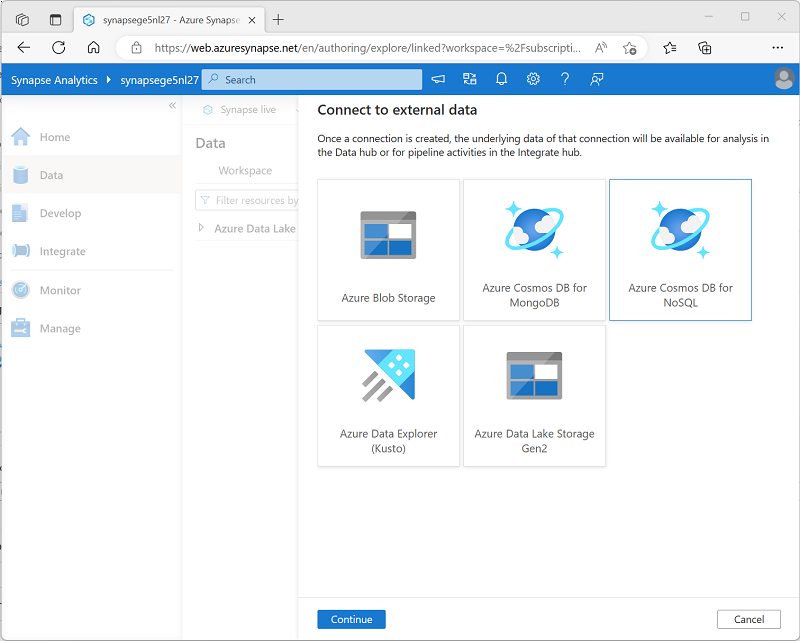

---
lab:
  title: 使用 Azure Synapse Link for Azure Cosmos DB
  ilt-use: Lab
---

# 使用 Azure Synapse Link for Azure Cosmos DB

Azure Synapse Link for Azure Cosmos DB 是一种云原生混合事务分析处理 (HTAP) 技术，使你能够通过 Azure Synapse Analytics 对存储在 Azure Cosmos DB 中的操作数据进行准实时的分析。

完成此练习大约需要 35 分钟。

## 准备工作

需要一个你在其中具有管理级权限的 [Azure 订阅](https://azure.microsoft.com/free)。

## 预配 Azure 资源

若要探索 Azure Synapse Link for Azure Cosmos DB，需要一个 Azure Synapse Analytics 工作区和一个 Azure Cosmos DB 帐户。 在本练习中，你将结合使用 PowerShell 脚本和 ARM 模板在 Azure 订阅中来预配这些资源。

1. 登录到 Azure 门户，地址为 [](https://portal.azure.com)。
2. 使用页面顶部搜索栏右侧的 [\>_] 按钮在 Azure 门户中创建新的 Cloud Shell，在出现提示时选择“PowerShell”环境并创建存储。 Cloud Shell 在 Azure 门户底部的窗格中提供命令行界面，如下所示：

    

    > 注意：如果以前创建了使用 Bash 环境的 Cloud shell，请使用 Cloud Shell 窗格左上角的下拉菜单将其更改为“PowerShell”。

3. 请注意，可以通过拖动窗格顶部的分隔条或使用窗格右上角的 &#8212;、&#9723; 或 X 图标来调整 Cloud Shell 的大小，以最小化、最大化和关闭窗格  。 有关如何使用 Azure Cloud Shell 的详细信息，请参阅 [Azure Cloud Shell 文档](https://docs.microsoft.com/azure/cloud-shell/overview)。

4. 在 PowerShell 窗格中，输入以下命令以克隆此存储库：

    ```
    rm -r dp-203 -f
    git clone https://github.com/MicrosoftLearning/dp-203-azure-data-engineer dp-203
    ```

5. 克隆存储库后，输入以下命令以更改为此练习的文件夹，然后运行其中包含的 setup.ps1 脚本：

    ```
    cd dp-203/Allfiles/labs/14
    ./setup.ps1
    ```

6. 如果出现提示，请选择要使用的订阅（仅当有权访问多个 Azure 订阅时才会发生这种情况）。
7. 出现提示时，输入要为 Azure Synapse SQL 池设置的合适密码。

    > 注意：请务必记住此密码！

8. 等待脚本完成 - 此过程通常需要大约 10 分钟；但在某些情况下可能需要更长的时间。 在等待期间，请查看 Azure Synapse Analytics 文档中的[什么是 Azure Synapse Link for Azure Cosmos DB？](https://docs.microsoft.com/azure/cosmos-db/synapse-link)一文。

## 在 Azure Cosmos DB 中配置 Synapse Link

在可以使用 Synapse Link for Azure Cosmos DB 之前，必须在 Azure Cosmos DB 帐户中启用它并将容器配置为分析存储。

### 在 Cosmos DB 帐户中启用 Synapse Link 功能

1. 在 [Azure 门户](https://portal.azure.com)中，浏览到由安装脚本创建的 dp203-xxxxxxx 资源组，并标识你的 Cosmos DB 帐户 cosmosxxxxxxxx 。

    > 注意：在某些情况下，脚本可能会尝试在多个区域创建 Cosmos DB 帐户，因此可能有一个或多个帐户处于“正在删除”状态。 活动帐户应是名称末尾数字最大的帐户 - 例如 cosmosxxxxxxx3。

2. 打开 Azure Cosmos DB 帐户，然后选择其边栏选项卡左侧的“数据资源管理器”页面。

    如果显示“欢迎”对话框，请将其关闭**

3. 在“数据资源管理器”页面顶部，使用“启用 Azure Synapse Link”按钮启用 Synapse Link 。

    

4. 在页面左侧的“集成”部分，选择“Azure Synapse Link”页面并验证帐户状态是否为“已启用” 。

### 创建分析存储容器

1. 返回到“数据资源管理器”页面，并使用“新建容器”按钮（或磁贴）创建一个具有以下设置的新容器 ：
    - 数据库 ID：（新建）AdventureWorks
    - 跨容器共享吞吐量：<u>未</u>选择
    - 容器 ID：Sales
    - 分区键：/customerid
    - 容器吞吐量（自动缩放）：自动缩放
    - 容器最大 RU/s：4000
    - **分析存储**：启用

    > 注意：在此场景中，customerid 用于分区键，因为它可能会在许多查询中用于检索假设应用程序中的客户和销售订单信息，它具有相对较高的基数（唯一值的数量），因此它允许容器随着客户和销售订单数量的增长而缩放。 使用自动缩放并将最大值设置为 4000 RU/s，这适用于最初查询量较少的新应用程序。 最大值设为 4000 RU/s 后，容器可以在不被需要时自动在此值至最大值的 10% (400 RU/s) 之间缩放。

2. 创建容器后，在“数据资源管理器”页面中，展开“AdventureWorks”数据库及其“Sales”文件夹；然后选择“Items”文件夹   。

    

3. 使用“新建项”按钮根据以下 JSON 创建新的客户项。 然后保存新项（保存项时将添加一些额外的元数据字段）。

    ```json
    {
        "id": "SO43701",
        "orderdate": "2019-07-01",
        "customerid": 123,
        "customerdetails": {
            "customername": "Christy Zhu",
            "customeremail": "christy12@adventure-works.com"
        },
        "product": "Mountain-100 Silver, 44",
        "quantity": 1,
        "price": 3399.99
    }
    ```

4. 使用以下 JSON 添加第二个项：

    ```json
    {
        "id": "SO43704",
        "orderdate": "2019-07-01",
        "customerid": 124,
        "customerdetails": {
            "customername": "Julio Ruiz",
            "customeremail": "julio1@adventure-works.com"
        },
        "product": "Mountain-100 Black, 48",
        "quantity": 1,
        "price": 3374.99
    }
    ```

5. 使用以下 JSON 添加第三个项：

    ```json
    {
        "id": "SO43707",
        "orderdate": "2019-07-02",
        "customerid": 125,
        "customerdetails": {
            "customername": "Emma Brown",
            "customeremail": "emma3@adventure-works.com"
        },
        "product": "Road-150 Red, 48",
        "quantity": 1,
        "price": 3578.27
    }
    ```

> 注意：实际上，分析存储将包含由应用程序写入存储的大量数据。 使用这几项足以演示本练习中的原理。

## 在 Azure Synapse Analytics 中配置 Synapse Link

现在你已准备好 Azure Cosmos DB 帐户，可以在 Azure Synapse Analytics 工作区中配置 Azure Synapse Link for Azure Cosmos DB。

1. 在 Azure 门户中，关闭 Cosmos DB 帐户的边栏选项卡（如果它仍然处于打开状态），然后返回到 dp203-xxxxxxx 资源组。
2. 打开 Synapse 工作区 synapsexxxxxxx，并在其概述页面上的“打开 Synapse Studio”卡中选择“打开”，以在新浏览器标签页中打开 Synapse Studio；如果出现提示，请登录   。
3. 在 Synapse Studio 左侧，使用 &rsaquo;&rsaquo; 图标展开菜单，这将显示 Synapse Studio 中的不同页面。
4. 在“数据”页面上，查看“链接”选项卡。工作区应已包含指向 Azure Data Lake Storage Gen2 存储帐户的链接，但没有指向 Cosmos DB 帐户的链接 。
5. 在“+”菜单中，选择“连接到外部数据”，然后选择“Azure Cosmos DB for NoSQL”  。

    

6. 继续，并使用以下设置创建新的 Cosmos DB 连接：
    - 名称：AdventureWorks
    - 说明：AdventureWorks Cosmos DB 数据库
    - 通过集成运行时连接：AutoResolveIntegrationRuntime
    - 身份验证类型：帐户密钥
    - 连接字符串：已选择
    - 帐户选择方式：从订阅
    - Azure 订阅：选择自己的 Azure 订阅
    - Azure Cosmos DB 帐户名：选择自己的 cosmosxxxxxxx 帐户**
    - 数据库名称：AdventureWorks
7. 创建连接后，使用“数据”页面右上角的“&#8635;”按钮刷新视图，直到在“链接”窗格中列出了“Azure Cosmos DB”类别   。
8. 展开“Azure Cosmos DB”类别以查看创建的“AdventureWorks”连接及其包含的“Sales”容器  。

    

## 从 Azure Synapse Analytics 查询 Azure Cosmos DB

现在你已准备好从 Azure Synapse Analytics 查询 Cosmos DB 数据库。

### 从 Spark 池查询 Azure Cosmos DB

1. 在“数据”窗格中，选择“Sales”容器，然后在其“...”菜单中选择“新建笔记本” > “加载到 DataFrame”    。
2. 在打开的新“笔记本 1”选项卡中的“附加到”列表中，选择 Spark 池 (*sparkxxxxxxx***) 。 然后使用“&#9655; 全部运行”运行笔记本中的所有单元格（目前只有一个！）。

    由于这是你第一次在此会话中运行 Spark 代码，因此必须启动 Spark 池。 这意味着会话中的第一次运行可能需要几分钟时间。 后续运行速度会更快。

3. 在等待 Spark 会话初始化时，查看生成的代码（可以使用工具栏右侧看起来类似于“&#128463;<sub>*</sub>”的“属性”按钮，以关闭“属性”窗格，以便可以更清楚地查看代码）  。 代码应如下所示：

    ```python
    # Read from Cosmos DB analytical store into a Spark DataFrame and display 10 rows from the DataFrame
    # To select a preferred list of regions in a multi-region Cosmos DB account, add .option("spark.cosmos.preferredRegions", "<Region1>,<Region2>")

    df = spark.read\
        .format("cosmos.olap")\
        .option("spark.synapse.linkedService", "AdventureWorks")\
        .option("spark.cosmos.container", "Sales")\
        .load()

    display(df.limit(10))
    ```

4. 代码运行完成后，查看笔记本中单元格下方的输出。 结果应包括三条记录；添加到 Cosmos DB 数据库中的每一项都有一条记录。 每条记录都包含在创建项目时输入的字段，以及一些自动生成的元数据字段。
5. 在上一单元格的结果下，使用“+ 代码”图标将新单元格添加到笔记本中，然后在其中输入以下代码：

    ```python
    customer_df = df.select("customerid", "customerdetails")
    display(customer_df)
    ```

6. 使用单元格左侧的“&#9655;”图标运行它，并查看结果；应如下所示：

    | customerid | customerdetails |
    | -- | -- |
    | 124 | "{"customername": "Julio Ruiz","customeremail": "julio1@adventure-works.com"}" |
    | 125 | "{"customername": "Emma Brown","customeremail": "emma3@adventure-works.com"}" |
    | 123 | "{"customername": "Christy Zhu","customeremail": "christy12@adventure-works.com"}" |

    此查询创建了一个新数据帧，其中仅包含 customerid 和 customerdetails 列 。 请注意，customerdetails 列包含源项中嵌套数据的 JSON 结构。 在显示的结果表中，可以使用 JSON 值旁边的“&#9658;”图标将其展开，并查看它所包含的各个字段。

7. 添加另一新代码单元格并输入以下代码：

    ```python
    customerdetails_df = df.select("customerid", "customerdetails.*")
    display(customerdetails_df)
    ```

8. 运行单元格并查看结果，其中应包括来自 customerdetails 值的 customername 和 customeremail 作为列  ：

    | customerid | customername | customeremail |
    | -- | -- | -- |
    | 124 | Julio Ruiz |julio1@adventure-works.com |
    | 125 | Emma Brown |emma3@adventure-works.com |
    | 123 | Christy Zhu | christy12@adventure-works.com |

    可通过 Spark 运行复杂的数据操作代码来重构和探索 Cosmos DB 中的数据。 在这种情况下，可通过 PySpark 语言导航 JSON 属性层次结构，以检索 customerdetails 字段的子字段。

9. 添加另一新代码单元格并输入以下代码：

    ```sql
    %%sql

    -- Create a logical database in the Spark metastore
    CREATE DATABASE salesdb;

    USE salesdb;

    -- Create a table from the Cosmos DB container
    CREATE TABLE salesorders using cosmos.olap options (
        spark.synapse.linkedService 'AdventureWorks',
        spark.cosmos.container 'Sales'
    );

    -- Query the table
    SELECT *
    FROM salesorders;
    ```

10. 运行新单元格以创建一个新的数据库，其中包含一个表，表中包括来自 Cosmos DB 分析存储的数据。
11. 添加另一新的代码单元格，然后输入并运行以下代码：

    ```sql
    %%sql

    SELECT id, orderdate, customerdetails.customername, product
    FROM salesorders
    ORDER BY id;
    ```

    此查询的结果应如下所示：

    | id | orderdate | customername | product |
    | -- | -- | -- | -- |
    | SO43701 | 2019-07-01 | Christy Zhu | Mountain-100 Silver, 44 |
    | SO43704 | 2019-07-01 | Julio Ruiz |Mountain-100 Black, 48 |
    | SO43707 | 2019-07-02 | Emma Brown |Road-150 Red, 48 |

    请注意，在使用 Spark SQL 时，可以将 JSON 结构的命名属性作为列进行检索。

12. 使“笔记本 1”选项卡保持打开状态 - 稍后你将返回到该选项卡。

### 从无服务器 SQL 池查询 Azure Cosmos DB

1. 在“数据”窗格中，选择“Sales”容器，然后在其“...”菜单中选择“新建 SQL 脚本” > “选择前 100 行”    。
2. 在打开的“SQL 脚本 1”选项卡中，隐藏“属性”窗格并查看已生成的代码，该代码应如下所示 ：

    ```sql
    IF (NOT EXISTS(SELECT * FROM sys.credentials WHERE name = 'cosmosxxxxxxxx'))
    THROW 50000, 'As a prerequisite, create a credential with Azure Cosmos DB key in SECRET option:
    CREATE CREDENTIAL [cosmosxxxxxxxx]
    WITH IDENTITY = ''SHARED ACCESS SIGNATURE'', SECRET = ''<Enter your Azure Cosmos DB key here>''', 0
    GO

    SELECT TOP 100 *
    FROM OPENROWSET(PROVIDER = 'CosmosDB',
                    CONNECTION = 'Account=cosmosxxxxxxxx;Database=AdventureWorks',
                    OBJECT = 'Sales',
                    SERVER_CREDENTIAL = 'cosmosxxxxxxxx'
    ) AS [Sales]
    ```

    SQL 池需要一个在访问 Cosmos DB 时使用的凭据，该凭据基于 Cosmos DB 帐户的授权密钥。 该脚本包含一个初始 `IF (NOT EXISTS(...` 语句，用于检查此凭据，如果不存在则会引发错误。

3. 将脚本中的 `IF (NOT EXISTS(...` 语句替换为以下代码以创建凭据，将 cosmosxxxxxxxx 替换为 Cosmos DB 帐户的名称：

    ```sql
    CREATE CREDENTIAL [cosmosxxxxxxxx]
    WITH IDENTITY = 'SHARED ACCESS SIGNATURE',
    SECRET = '<Enter your Azure Cosmos DB key here>'
    GO
    ```

    整个脚本现应如下所示：

    ```sql
    CREATE CREDENTIAL [cosmosxxxxxxxx]
    WITH IDENTITY = 'SHARED ACCESS SIGNATURE',
    SECRET = '<Enter your Azure Cosmos DB key here>'
    GO

    SELECT TOP 100 *
    FROM OPENROWSET(PROVIDER = 'CosmosDB',
                    CONNECTION = 'Account=cosmosxxxxxxxx;Database=AdventureWorks',
                    OBJECT = 'Sales',
                    SERVER_CREDENTIAL = 'cosmosxxxxxxxx'
    ) AS [Sales]
    ```

4. 切换到包含 Azure 门户的浏览器标签页（或打开一个新的标签页并在 [https://portal.azure.com](https://portal.azure.com) 中登录到 Azure 门户）。 然后在 dp203-xxxxxxx 资源组中，打开 Azure Cosmos DB 帐户 cosmosxxxxxxxx 。
5. 在左侧窗格的“设置”部分，选择“键”页 。 然后将“主键”值复制到剪贴板。
6. 切换回 Azure Synapse Studio 中包含 SQL 脚本的浏览器标签页，并将键粘贴到替换 \<Enter your Azure Cosmos DB key here\> 占位符的代码中，使脚本如下所示：

    ```sql
    CREATE CREDENTIAL [cosmosxxxxxxxx]
    WITH IDENTITY = 'SHARED ACCESS SIGNATURE',
    SECRET = '1a2b3c....................................=='
    GO

    SELECT TOP 100 *
    FROM OPENROWSET(PROVIDER = 'CosmosDB',
                    CONNECTION = 'Account=cosmosxxxxxxxx;Database=AdventureWorks',
                    OBJECT = 'Sales',
                    SERVER_CREDENTIAL = 'cosmosxxxxxxxx'
    ) AS [Sales]
    ```

7. 使用“&#9655; 运行”按钮运行脚本，并查看结果，其中应包括三条记录；添加到 Cosmos DB 数据库中的每一项都有一条记录。

    现你已创建了凭据，可以在针对 Cosmos DB 数据源的任何查询中使用它。

8. 将脚本中的所有代码（CREATE CREDENTIAL 和 SELECT 语句）替换为以下代码（将 cosmosxxxxxxxx 替换为 Azure Cosmos DB 帐户的名称）：

    ```sql
    SELECT *
    FROM OPENROWSET(PROVIDER = 'CosmosDB',
                    CONNECTION = 'Account=cosmosxxxxxxxx;Database=AdventureWorks',
                    OBJECT = 'Sales',
                    SERVER_CREDENTIAL = 'cosmosxxxxxxxx'
    )
    WITH (
        OrderID VARCHAR(10) '$.id',
        OrderDate VARCHAR(10) '$.orderdate',
        CustomerID INTEGER '$.customerid',
        CustomerName VARCHAR(40) '$.customerdetails.customername',
        CustomerEmail VARCHAR(30) '$.customerdetails.customeremail',
        Product VARCHAR(30) '$.product',
        Quantity INTEGER '$.quantity',
        Price FLOAT '$.price'
    )
    AS sales
    ORDER BY OrderID;
    ```

9. 运行脚本并查看结果，结果应与 `WITH` 子句中定义的架构相匹配：

    | OrderID | OrderDate | CustomerID | CustomerName | CustomerEmail | 产品 | 数量 | 价格 |
    | -- | -- | -- | -- | -- | -- | -- | -- |
    | SO43701 | 2019-07-01 | 123 | Christy Zhu | christy12@adventure-works.com | Mountain-100 Silver, 44 | 1 | 3399.99 |
    | SO43704 | 2019-07-01 | 124 | Julio Ruiz | julio1@adventure-works.com | Mountain-100 Black, 48 | 1 | 3374.99 |
    | SO43707 | 2019-07-02 | 125 | Emma Brown | emma3@adventure-works.com | Road-150 Red, 48 | 1 | 3578.27 |

10. 使“SQL 脚本 1”选项卡保持打开状态 - 稍后你将返回到该选项卡。

### 验证 Cosmos DB 中的数据修改是否反映在 Synapse 中 

1. 使包含 Synapse Studio 的浏览器标签页保持打开状态，切换回包含 Azure 门户的标签页，它应在 Cosmos DB 帐户的“键”页面上处于打开状态。
2. 在“数据资源管理器”页面上，展开“AdventureWorks”数据库及其“Sales”文件夹；然后选择“Items”文件夹   。
3. 使用“新建项”按钮根据以下 JSON 创建新的客户项。 然后保存新项（保存项时将添加一些额外的元数据字段）。

    ```json
    {
        "id": "SO43708",
        "orderdate": "2019-07-02",
        "customerid": 126,
        "customerdetails": {
            "customername": "Samir Nadoy",
            "customeremail": "samir1@adventure-works.com"
        },
        "product": "Road-150 Black, 48",
        "quantity": 1,
        "price": 3578.27
    }
    ```

4. 返回 Synapse Studio 选项卡，并在“SQL 脚本 1”选项卡中重新运行查询。 最初，它可能会显示与以前相同的结果，但请等待一分钟左右，然后再次重新运行查询，直到结果包括 2019-07-02 向 Samir Nadoy 的销售记录。
5. 切换回“笔记本 1”选项卡并重新运行 Spark 笔记本中的最后一个单元格，以验证查询结果中现在是否包含向 Samir Nadoy 的销售记录。

## 删除 Azure 资源

你已完成对 Azure Synapse Analytics 的探索，现在应删除已创建的资源，以避免产生不必要的 Azure 成本。

1. 关闭 Synapse Studio 浏览器选项卡并返回到 Azure 门户。
2. 在 Azure 门户的“主页”上，选择“资源组”。
3. 选择 Synapse Analytics 工作区的 dp203-xxxxxxx 资源组（不是托管资源组），并确认它包含 Synapse 工作区、存储帐户和工作区及 Azure Cosmos DB 帐户的 Spark 池。
4. 在资源组的“概述”页的顶部，选择“删除资源组”。
5. 输入 dp203-xxxxxxx 资源组名称以确认要删除该资源组，然后选择“删除” 。

    几分钟后，将删除 Azure Synapse 工作区资源组及其关联的托管工作区资源组。
