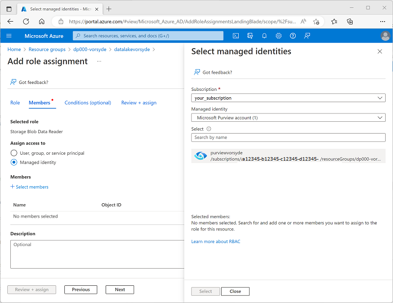

---
lab:
  title: 将 Microsoft Purview 与 Azure Synapse Analytics 配合使用
  ilt-use: Lab
---

# 将 Microsoft Purview 与 Azure Synapse Analytics 配合使用

使用 Microsoft Purview，可以跨数据资产对数据资产进行编录，并在数据从一个数据源传输到另一个数据源时跟踪数据流，这是综合数据治理解决方案的关键元素。

完成此练习大约需要 40 分钟。

## 准备工作

需要一个你在其中具有管理级权限的 [Azure 订阅](https://azure.microsoft.com/free)。

## 预配 Azure 资源

在本练习中，你将使用 Microsoft Purview 跟踪 Azure Synapse Analytics 工作区中的资产和数据世系。 首先，你将使用脚本在 Azure 订阅中预配这些资源。

1. 登录到 Azure 门户，地址为 [](https://portal.azure.com)。
2. 使用页面顶部搜索栏右侧的 [\>_] 按钮在 Azure 门户中创建新的 Cloud Shell，在出现提示时选择“PowerShell”环境并创建存储。 Cloud Shell 在 Azure 门户底部的窗格中提供命令行界面，如下所示：

    

    > 注意：如果以前创建了使用 Bash 环境的 Cloud shell，请使用 Cloud Shell 窗格左上角的下拉菜单将其更改为“PowerShell”。

3. 请注意，可以通过拖动窗格顶部的分隔条或使用窗格右上角的 &#8212;、&#9723; 或 X 图标来调整 Cloud Shell 的大小，以最小化、最大化和关闭窗格  。 有关如何使用 Azure Cloud Shell 的详细信息，请参阅 [Azure Cloud Shell 文档](https://docs.microsoft.com/azure/cloud-shell/overview)。

4. 在 PowerShell 窗格中，输入以下命令以克隆此存储库：

    ```
    rm -r dp-203 -f
    git clone https://github.com/MicrosoftLearning/dp-203-azure-data-engineer dp-203
    ```

5. 克隆存储库后，输入以下命令以更改为此实验室的文件夹，然后运行其中包含的 setup.ps1 脚本：

    ```
    cd dp-203/Allfiles/labs/22
    ./setup.ps1
    ```

6. 如果出现提示，请选择要使用的订阅（仅当有权访问多个 Azure 订阅时才会发生这种情况）。
7. 出现提示时，为 Azure SQL 数据库输入合适的密码。

    > 注意：请务必记住此密码！

8. 等待脚本完成 - 这通常需要大约 15 分钟，但在某些情况下可能需要更长的时间。 在等待时，请查看 Microsoft Purview 文档中的 [Microsoft Purview 治理门户中有哪些可用功能？](https://docs.microsoft.com/azure/purview/overview)一文。

> **提示**：如果你在运行安装脚本后决定不完成实验室，请务必删除在 Azure 订阅中创建的 dp203-*xxxxxxx* 资源组，以避免产生不必要的 Azure 成本。

## 在 Microsoft Purview 中编目 Azure Synapse Analytics 数据资产

借助 Microsoft Purview，可以跨数据资产（包括 Azure Synapse 工作区中的数据源）对数据资产进行编目。 使用脚本部署的工作区包括 Azure Data Lake Storage Gen2 帐户中的数据湖、无服务器数据库和专用 SQL 池中的数据仓库。

### 为 Microsoft Purview 配置基于角色的访问控制

Microsoft Purview 已被配置为使用托管标识。 为编录数据资产，此托管标识帐户必须有权访问 Azure Synapse Analytics 工作区及其 Data Lake Store 的存储帐户。

1. 在 [Azure 门户](https://portal.azure.com)中，浏览到由安装脚本创建的 dp203-*xxxxxxx* 资源组并查看它创建的资源。 其中包括：
    - 名称类似于 *datalakexxxxxxx*** 的存储帐户。
    - 名称类似于 *purviewxxxxxxx*** 的 Microsoft Purview 帐户。
    - 名称类似于 *sqlxxxxxxx*** 的专用 SQL 池。
    - 名称类似于 *synapsexxxxxxx*** 的 Synapse 工作区。
2. 打开 datalake*xxxxxxx* 存储帐户，在其“访问控制(标识和访问管理)”页上查看“角色分配”选项卡，如下所示  ：

    

3. 在“+ 添加”按钮菜单上，选择“添加角色分配” 。 
4. 在“添加角色分配”页的“角色”选项卡上，搜索“存储 blob”并选择“存储 Blob 数据读取者”角色  。 然后选择“下一步”，移动到“成员”选项卡 ：

    

5. 在“成员”选项卡的“将访问权限分配给”列表中，选择“托管标识”，然后在“成员”下选择“选择成员”    。
6. 在“选择托管标识”窗格中的“托管标识”下拉列表中选择“Microsoft Purview 帐户(n)”，然后选择自己的 Microsoft Purview 帐户（该帐户名称应类似于 *purviewxxxxxxx***）并使用“选择”按钮将此帐户添加到角色分配  ：

    

7. 使用“查看 + 分配”按钮完成角色分配，这样能让 Microsoft Purview 资源的托管标识使用的 purview*xxxxxxx* 帐户成为存储帐户的“存储 Blob 数据读取者”角色的成员  。
8. 在 Azure 门户中返回到 dp203-*xxxxxxx* 资源组并打开 synapse*xxxxxxx* Synapse Analytics 工作区 。 然后，在其“访问控制(标识和访问管理)”页上添加角色分配，使 purview*xxxxxxx* 托管标识帐户成为工作区中“读取者”角色的成员  。

### 为 Microsoft Purview 配置数据库权限

Azure Synapse Analytics 工作区包括无服务器和专用 SQL 池中的数据库，Microsoft Purview 使用的托管标识需要访问这些数据库 。

1. 在 Azure 门户中的 Synapse Analytics 工作区的页面上，查看“概述”选项卡。然后，在“打开 Synapse Studio”磁贴中，使用链接在新浏览器选项卡中打开 Azure Synapse Studio，并按提示进行登录 。

    >**提示**：或者，可以通过在新的浏览器选项卡中直接浏览到 https://web.azuresynapse.net 来打开 Azure Synapse Studio。

2. 在 Synapse Studio 左侧，使用 &rsaquo;&rsaquo; 图标展开菜单，这将显示 Synapse Studio 中的不同页面。
3. 在“管理”页的“SQL 池”选项卡上，选择 sqlxxxxxxx 专用 SQL 池所在的行，并使用其 &#9655; 图标进行启动；在出现系统提示时确认进行恢复   **。

    

4. 等待 SQL 池恢复。 这可能需要几分钟的时间。 可以使用“&#8635; 刷新”按钮定期检查其状态。 状态将在准备就绪时显示为“联机”。
5. 在 Azure Synapse Studio 中查看“数据”页，并在“工作区”选项卡中展开“SQL 数据库”以查看工作区中的数据库  。 其中应包括：
    - 名为 lakedb 的无服务器 SQL 池数据库。
    - 名为 *sql xxxxxxx*** 的专用 SQL 池数据库。

    

6. 选择 lakedb 数据库，然后在其“...”菜单中选择“新建 SQL 脚本” > “空脚本”以打开新的“SQL 脚本 1”窗格    。 然后使用工具栏右端的“属性”按钮（看起来类似于“&#128463;”<sub>*</sub>）隐藏“属性”窗格，从而更清楚地查看脚本窗格  。
7. 在“SQL 脚本 1”窗格中，输入以下 SQL 代码，并将其中出现的所有 purviewxxxxxxx 替换为自己的 Microsoft Purview 帐户的托管标识名称：

    ```sql
    CREATE LOGIN purviewxxxxxxx FROM EXTERNAL PROVIDER;
    GO

    CREATE USER purviewxxxxxxx FOR LOGIN purviewxxxxxxx;
    GO

    ALTER ROLE db_datareader ADD MEMBER purviewxxxxxxx;
    GO
    ```

8. 使用“&#9655; 运行”按钮运行脚本，该脚本在无服务器池中创建一个登录名，在 lakedb 用户中为 Microsoft Purview 使用的托管标识创建一个用户，并将该用户添加到 lakedb 数据库中的 db_datareader 角色   。
9. 为 sql*xxxxxxx* 专用 SQL 池数据库创建一个新的空脚本，并使用它来运行以下 SQL 代码（将 purviewxxxxxxx 替换为自己的 Microsoft Purview 帐户的托管标识名称），这样能在专用 SQL 池中为 Microsoft Purview 使用的托管标识创建用户，并将其添加到 sql*xxxxxxx* 数据库中的 db_datareader 角色 。

    ```sql
    CREATE USER purviewxxxxxxx FROM EXTERNAL PROVIDER;
    GO

    EXEC sp_addrolemember 'db_datareader', purviewxxxxxxx;
    GO
    ```

### 在 Microsoft Purview 目录中注册源

现在，你已配置 Microsoft Purview 所需的访问权限以扫描 Azure Synapse Analytics 工作区使用的数据源，可以在 Microsoft Purview 目录中注册这些数据源。

1. 切换回包含 Azure 门户的浏览器选项卡，并查看 dp203-*xxxxxxx* 资源组的页面。
2. 打开 purview*xxxxxxx* Microsoft Purview 帐户，使用“概述”页上的链接在新的浏览器选项卡中打开 Microsoft Purview 治理门户，并按提示进行登录  。

    >**提示**：你也可以直接在新的浏览器选项卡中浏览到 https://web.purview.azure.com 。

3. 在 Azure Purview 治理门户左侧，使用 &rsaquo;&rsaquo; 图标展开菜单，这将显示门户中的不同页面。
4. 在“数据映射”页上的“源”子页面上选择“注册”  ：

    

5. 在此时显示出来的“注册源”选项卡中选择“Azure Synapse Analytics”，然后继续按照以下设置注册源 ：
    - **名称**：Synapse_data
    - Azure 订阅：选择自己的 Azure订阅
    - **工作区名称**：选择你的 synapsexxxxxxx 工作区**
    - **专用 SQL 终结点**：sqlxxxxxxx.sql.azuresynapse.net
    - **无服务器 SQL 终结点**：sqlxxxxxxx-ondemand.sql.azuresynapse.net
    - **选择集合**：Root (purviewxxxxxxx)

    此数据源包括 Azure Synapse Analytics 工作区中的 SQL 数据库。

6. 注册 Synapse_data 源后，再次选择“注册”，并为 Azure Synapse 工作区使用的 Data Lake 存储注册第二个源 。 选择“Azure Data Lake Storage Gen2”，并指定以下设置：
    - **名称**：Data_lake
    - Azure 订阅：选择自己的 Azure订阅
    - **工作区名称**：选择你的 datalakexxxxxxx 存储帐户**
    - **终结点**： https:/ /datalakexxxxxxx.dfs.core.windows.net/
    - **选择集合**：Root (purviewxxxxxxx)
    - **数据使用管理**：已禁用

    注册 Synapse_data 源和 Data_lake 源后，它们都应显示在数据映射中的 purview*xxxxxxx* 根集合下，如下所示  ：

    

### 扫描已注册的源

1. 在数据映射中的 Synapse_data 源中选择“查看详细信息”，并观察该源没有已编录的资产 。 需要扫描源以查找它包含的数据资产。
2. 在 Synapse_data 的详细信息页中选择“新建扫描”，然后使用以下设置配置扫描 ：
    - **名称**：Scan-Synapse
    - **连接到集成运行时**：Azure AutoresolveIntegrationRuntime
    - **类型**：SQL 数据库
    - **凭据**：Microsoft Purview MSI (系统)
    - **SQL 数据库**：选择 sqlxxxxxxx 专用数据库<u>和</u> lakedb 无服务器数据库* *。
    - **选择集合**：Root (purviewxxxxxxx)

    

3. 继续转到“选择扫描规则集”页，其中应该已选择默认的 AzureSynapseSQL 规则集 。
4. 继续转到“设置扫描触发器”页，然后选择“一次”以运行一次性扫描 。
4. 继续转到“查看扫描”页，然后保存并运行扫描。
6. 当 Synapse_data 扫描正在运行时，返回到“源”页以查看数据映射，并在 Data_lake 源中使用“新建扫描”图标使用以下设置启动数据湖扫描   ：
    - **名称**：Scan-Data-Lake
    - **连接到集成运行时**：Azure AutoresolveIntegrationRuntime
    - **凭据**：Microsoft Purview MSI (系统)
    - **选择集合**：Root (purviewxxxxxxx)
    - **确定扫描范围**：选择 Data_lake 和所有子资产** 
    - **选择扫描规则集**：AdlsGen2
    - **设置扫描触发器**：一次
    - 查看扫描信息并选择“保存并运行”
7. 等待这两个扫描完成，这可能需要几分钟时间。 可以查看每个源的详细信息页以查看“上次运行状态”，如下所示（恶意使用“&#8635; 刷新”按钮更新该状态） 。 还可以查看“监视”页（不过扫描可能需要一段时间才能显示在此页面中）：

    

### 查看扫描到的资产

1. 在“数据目录”页上的“浏览”子页面上选择 purview*xxxxxxx* 集合  。 可在此处查看 Azure Synapse 工作区和数据湖存储中编录的数据资产，包括 Azure Synapse Analytics 工作区、Data Lake 的 Azure 存储帐户、Azure Synapse Analytics 中的两个 SQL 池数据库、每个数据库中的 dbo 架构、数据库中的表和视图，以及数据湖中的文件夹和文件。
2. 若要筛选结果，可以按不同的对象类型缩小结果范围，请在“结果缩小依据”列表中选择“文件”和“表”，即可仅列出扫描编录的文件、表和视图  ：

    

    请注意，数据资产包括：

    - **products** - 专用 SQL 池中用于存储产品数据的表。
    - **products.csv** - 数据湖中的文件。
    - **products_csv** - 无服务器 SQL 池中从 products.csv 文件读取产品数据的视图。

3. 通过选择找到的资产并查看其属性和架构来浏览它们。 可以编辑资产的属性（包括各个字段）以添加元数据、分类、行业专家的联系方式以及其他有用详细信息，这样数据分析师就能通过在 Microsoft Purview 数据目录中浏览这些数据资产来查找有关数据资产的大量信息。

到目前为止，你已使用 Microsoft Purview 对 Azure Synapse Analytics 工作区中的数据资产进行编目。 可以在 Microsoft Purview 目录中注册多种类型的数据源，从而为数据资产创建集中的综合视图。

现在，我们来探讨一些集成 Azure Synapse Analytics 和 Microsoft Purview 的其他方法。

## 集成 Microsoft Purview 和 Azure Synapse Analytics

Azure Synapse Analytics 支持与 Microsoft Purview 集成，使数据资产可发现，并通过将数据从一个源传输到另一个源的引入管道跟踪数据世系。

### 在 Azure Synapse Analytics 中实现 Microsoft Purview 集成

1. 切换回包含 Synapse Studio 的浏览器选项卡，在“管理”页上选择“Microsoft Purview”选项卡，然后使用“连接到 Purview 帐户”按钮将订阅中的 purview*xxxxxxx* 帐户连接到工作区   。
2. 连接帐户后，查看“Purview 帐户”选项卡，验证帐户的“数据世系 - Synapse 管道”状态是否为“已连接”  ：

    

### 在 Synapse Studio 中搜索 Purview 目录

将 Microsoft Purview 帐户连接到 Azure Synapse Analytics 工作区后，可以从 Synapse Studio 搜索目录，从而发现自己的数据产业中的数据资产。

1. 在 Synapse Studio 中查看“集成”页。
2. 使用页面顶部的“搜索”框，在 Purview 源中搜索“products”一词，如下所示 ：

    

3. 在结果中选择“products.csv”，从 Purview 目录中查看其详细信息。

通过将 Purview 目录集成到 Synapse Studio 界面中，数据分析师和工程师可以查找和检查整个数据产业（而不仅仅是在 Azure Synapse Studio 工作区）中已注册的数据资产。

### 创建和运行管道

lakedb 数据库中的 products_csv 视图基于包含产品数据的数据湖中的文本文件 。 sql*xxxxxxx* 专用 SQL 数据库中的 products 表当前为空 。 让我们使用 Synapse 管道将数据从数据湖加载到表中。

1. 在 Synapse Studio 的“集成”页上的“+”菜单中选择“复制数据工具”  。
2. 在“复制数据”工具中，选择“内置复制任务”和“立即运行一次”，然后选择“下一步”  。
3. 在“源数据存储”页上的“连接”列表中选择“synapsexxxxxxx-WorkspaceDefaultStorage”连接（该连接引用工作区的数据湖），在“文件或文件夹”处浏览到 files/products/products.csv 文件    。 然后，选择“下一步”。
4. 在“文件格式设置”页上，选择“检测文本格式” 。 然后请在选择“下一步”之前确保指定了以下设置：
    - **文件格式**： DelimitedText
    - 列分隔符：逗号 (,)
    - 行分隔符：换行符 (\n)
    - 首行用作标题：已选择
    - 压缩类型：无
5. 在“目标数据存储”页上的“连接”列表中，选择“sql*xxxxxxx*”（与专用 SQL 池的连接）  。 然后将目标设置为现有 dbo.products 表，然后选择“下一步” 。
6. 在“列映射”页上查看默认列映射，然后选择“下一步” 。
7. 在“设置”页上将“任务名称”设置为“Load_Product_Data”  。 然后选择大容量插入复制方法，并选择“下一步” 。
8. 在“摘要”页上，选择“下一步”。
9. 等待管道部署完毕，然后选择“完成”。
10. 在 Synapse Studio 中查看“监视”页。 然后在“管道运行”选项卡上，观察 Load_Product_Data 管道的状态 。 状态可能在几分钟后才会变为“成功”。
11. 管道运行成功完成后，选择其名称 (Load_Product_Data) 以查看管道中活动的详细信息；另请注意管道包含一个复制数据任务，其名称自动派生的名称类似于 *Copy_xxx** 的名称。此活动将数据从数据湖中的文本文件复制到 sql*xxxxxxx 数据库的 products 表中  * *。

### 在 Microsoft Purview 中查看数据世系

你已使用 Synapse 管道将数据加载到数据库中。 让我们验证是否已在 Microsoft Purview 中跟踪此活动。

1. 切换到包含 Microsoft Purview 治理门户的浏览器选项卡。
2. 在“数据目录”页上的“浏览”子页面上选择 purview*xxxxxxx* 集合  。
3. 筛选资产以仅显示数据管道、文件和表  。 资产列表应包括 products.csv 文件、Copy_*xxx* 管道活动和 products 表  。
4. 选择 Copy_*xxx* 资产以查看其详细信息，并注意“更新时间”反映的是最近的管道运行 。
5. 在 Copy_*xxx* 资产的“世系”选项卡上，查看展示从 products.csv 文件到 products 表的数据流的示意图   ：

    

6. 在 Copy_*xxx* 世系示意图中，选择 products.csv 文件并使用它的“切换到资产”链接查看源文件的详细信息  。
7. 在 products.csv 世系关系图中，选择 products 表并使用它的“切换到资产”链接查看表的详细信息（可以需要使用“&#8635; 刷新”按钮来查看表世系示意图   ）。

通过将 Azure Synapse Analytics 与 Microsoft Purview 集成来启用世系跟踪功能，你可以确定数据存储中的数据的加载方式和时间，以及数据的来源。

> **提示**：在本练习中，你查看了有关 Microsoft Purview 治理门户中的世系的信息；但请记住，也可以通过搜索集成功能在 Synapse Studio 中查看相同的资产。

### 暂停专用 SQL 池

1. 切换回“Synapse Studio”选项卡，并在“管理”页上暂停 sql*xxxxxxx* 专用 SQL 池 。

## 删除 Azure 资源

你已完成对 Azure Synapse Analytics 的探索，现在应删除已创建的资源，以避免产生不必要的 Azure 成本。

1. 关闭 Synapse Studio 浏览器选项卡并返回到 Azure 门户。
2. 在 Azure 门户的“主页”上，选择“资源组”。
3. 选择 Synapse Analytics 工作区的 dp203-xxxxxxx 资源组（不是托管资源组），并确认它包含 Synapse 工作区、存储帐户和工作区的专用 SQL 池。
4. 在资源组的“概述”页的顶部，选择“删除资源组”。
5. 输入 dp203-xxxxxxx 资源组名称以确认要删除该资源组，然后选择“删除” 。

    几分钟后，将删除 Azure Synapse 工作区资源组及其关联的托管工作区资源组。
